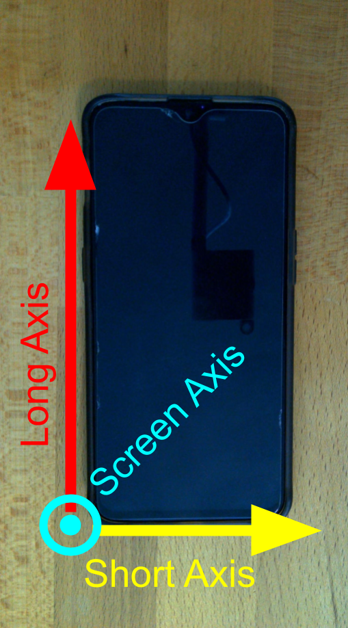

# INTRODUCTION TO PHYPHOX & ERROR
---

:::Note
There are two videos in this lab. Sometimes the Safari browser has issues playing them. Try switching to Chrome or Firefox. Additionally, sometimes if you click the pop-out button it will play for you when it wouldn't play on the page.
:::

---
## INTRODUCTION
The goal of this assignment is to prepare you for the rest of the quarter. In this lab, we are going to focus on two things: 
 - Getting familiar with the phyphox app.
 - Performing some basic data analysis.  

**An important point for these labs as that we are not looking for the "right answer" but we instead want you to be able to explain and justify the answers that you get.**

---

## PART 0: GETTING FAMILIAR WITH THE FORMAT

In all of the lab manuals you will notice some common environments. Each environment will have different tasks that you need to do in order to get full credit.

### Exercises

::: Exercise
This is an exercise. An exercise is an encapsulated task to cover one idea or concept. Inside of an exercise, you might be asked to do different subtasks. Each of these subtasks should be included in your report. **If they are not, you will lose points**.

Typical subtasks might include:
- Making a table.
- Making a plot.
- Taking a screenshot of something you did on your computer.
- Making a hand drawing, and including a picture of it. 

This is not an exhaustive list, but includes the most common subtasks you will need to do. 

---
As practice, for this exercise, create a list of the following three things:
1. Your name.
2. What major you want to graduate with.
3. The person who has won the largest share of the 2019 Nobel Prize in physics. 

When writing your lab report, make it as clear as possible as to which exercise you are responding. 
:::

### Questions
::: Question
This is a question. Questions will be something that you should respond directly to. There may be many different parts to a question and you should answer each part. Sometimes questions are inside of exercises and other times they are not. 

Questions should be answered with a **full sentence** to get full credit. Some examples of bad answers are:
- Yes.
- It's bigger.
- It looks like it.
- Linear.

These sorts of answers will receive little to no credit.

---

Please answer the following for this question:

a.  Who is your TA?

b. What time is your section? 
:::

### Notes
::: Note
This is a note. Notes don't require you to put anything in your report. 

The main point of a note is just to highlight some critical information for you. Please make sure to read every note.
:::

### Conclusion
Each lab report will ask you to write a conclusion statement about the main point of the lab. This should be a 1-3 sentence statement highlighting most important point(s) of the lab. It should not describe how you feel about the lab, or reexplain what you did. A good example would be:

> In this lab we showed that falling objects in air do not fall with constant acceleration. The major factors affecting air resistance are mass and cross sectional area. 

A bad example would be:

> In this lab I dropped a ball and timed how long it took to hit the ground. This was really cool and showed that things have air resistance. I really liked how some balls fell faster than others. This demonstrated to me that air can really affect things.

---

## PART 1: PHYPHOX

Phyphox is an app that allows you to collect data from all of the different sensors in your phone. Almost all smart phones have accelerometers, speakers, and microphones in them, which is the majority of what we will be using. You may find that your smartphone has other sensors available to Phyphox, such as a pressure gauge, temperature sensor, or light sensor. You can feel free to use whatever is available to you in future experiments. 

### Determining the Axes of your accelerometer

:::Exercise
 In this exercise you will determine the three axes of the accelerometer in your phone. First we should define a coordinate system for your phone.
 
:::Figure:Figure
 
:::

Figure 1 shows the what we will call each axis of our phone. The screen axis is pointing out of the screen at you. 

Watch the video below to get the procedure. 
 
:::Figure:Video
!(https://www.youtube.com/watch?v=NrAygsCGgA4)
:::

A quick summary is here:

1.  Open Phyphox and select the "Accelerometer wtih g" sensor. This will measure the acceleration along each axis and it will include the acceleration due to gravity in the down word direction.
2.  Below the orange bar at the top of the screen select "Simple". This will display the acceleration along each axis as just a number. 
3.  Place your phone flat on a table and click the play button.
4.  Because your phone is flat, the acceleration vector, "g", is pointed through your screen and aligned with the screen axis (the one that goes in and out of your screen). If an accelerometer axis  is aligned with the screen axis, then only that accelerometer axis should have a reading close to $9.8 m/s^2$. Thus whatever direction that is (for me in the video it was z) is the axis that is aligned with the screen.
5.  Rotate you phone so that the long edge of your phone is pointing straight up. Now a different axis is aligned with acceleration vector.
6.  Repeat for the last axis. 

::: Question
Create a list that maps the three phone axes to the accelerometer axes. i.e. Screen=Z, Long=... etc.
:::

::: Question
Create a diagram of your phone and label the axes. The phone can just be a rectangle. Use either a computer to make the drawing, or do it by hand and take a picture (Just make sure it is legible).
:::

:::

### Measuring Acceleration Due to Gravity (g) with Phyphox

:::Exercise
 
In this exercise we will measure g using the accelerometer in your phone. We will again use "Acceleration With g". We will collect data for all three axes, and in each direction (i.e. having the phone both face up and face down). We will just collect the data in this exercise, but the data will be analyzed later.

The instructions in the video are just a guide for how you might perform the experiment. You may follow the video exactly, but feel free to make any improvements to the procedure.

:::Figure:Video
!(https://www.youtube.com/watch?v=b2t__LSNqn8)
:::
 
 1. Start by opening Phyphox and selecting the "Acceleration With g" sensor again. 
 2. Before you start recording develop a plan for how you will switch between all the orientations (+x, -x, +y, -y, +z, -z) . You want to keep the phone in each orientation for a couple seconds, but you want want your recording time to get too much longer than ~15 seconds.
 3. When you have your plan, press play and cycle through aligning each axis with the acceleration vector "g".
 4. Export your data to somewhere you can use it later.
 
 :::Note
 In this class we will demonstrate analysis using google sheets. You can use excel, MATLAB, or something else to do your data analysis, but you will only be supported with google sheets.
 :::
 
::: Question
 Take a screenshot of your three plots, x, y, and z, and include it in your lab report.
:::

:::Question
Write a brief paragraph (or two) describe how you made the measurement. If you made any improvements to the procedure describe them here and explain why you did what you did.
:::

:::

## PART 2: ANALYZING DATA
Physics is the study of the laws of nature through observation and experiment. In an experiment, we perform measurements and collect data, then we interpret the data and  derive trends and relationships between our variables.

## Uncertainty in measurement

When we measure a quantity, say the length of a pencil, we will never be able to measure the **true value** of the length. Instead, if we are careful and thoughtful in our measurement, we will get a length close to the true length, our **best estimate**. The most honest way to report our measurement to others is to provide our best estimate and a window of values in which the true length might fall. This window is called our **uncertainty**. We would typically write down the length of the pencil in the following format.

$$
62.33 \pm 0.05 \text{ cm}
$$

The 62.33 cm is our best estimate, and the 0.05 cm is our estimate of the uncertainty.  We are saying that our best guess at the true length of the rod is 62.33cm but the true length is most likely between 62.28cm and 62.38cm.

:::Note
**UNCERTANTY IS UNAVOIDABLE IN EVERY MEASUREMENT.**
:::

## Sources of Error

Error in a measurement is any deviation from the true value that is being measured. Error does not mean that you made a mistake.

There are two main types of errors: **systematic** and **random**.

**Systematic errors** arise from improper use of the measurement equipment and  improper experimental techniques. Systematic uncertainties are consistent between measurements: if you repeat the experiment, you'll get the same error. 

For example, when we measure the length of the pencil, if the ruler is made out of metal and the temperature of the room is very low, the ruler might be contracted. That implies that the ruler is actually shorter than it should be, and our best estimate for the length of the pencil will always be larger than its true value.

Another systematic error would be introduced if we didn't keep the line of sight perpendicular to the ruler when measuring the pencil length.

We can completely prevent systematic errors by calibrating and checking the equipment and using proper measurement techniques. 

**Random error**
 
If we repeat a measurement, the values of the measured quantity will  be different from each other and will be randomly distributed around a mean value, which we will take to be our best estimate. 

We can't eliminate random errors, but we can minimize them by using precise instruments and by collecting a  large data set for calculating the average of our measurements. Thus, we need to perform multiple trials by repeating the experiment several times to average out the random errors. 

***Random error leads to uncertainty in our measurement. ***

This random error is what we quote in the above example as 0.05 cm. 

The video below shows an example of random error you have already seen in this lab. 

::: Figure:Video
!(https://www.youtube.com/watch?v=EyucI5jm0Bs)
:::

:::Note
Systematic error should be eliminated as a source of error from our experiment.

Random error is unavoidable and leads to uncertainty in our measurement.
:::

 
 
 ### Accuracy and Precision
 
Systematic errors will  cause bias in one direction, causing your measurements to be consistently higher or lower than the accepted value. These errors will determine the **accuracy** of your measurement.

Random errors are unbiased, so some of your measurements will be higher and some will be lower than the accepted value. Random errors will determine the **precision** of your measurement.

- ***Accuracy*** = how close the measured values are to the **true value**
-  ***Precision*** = how close the measured values are to **each other**

:::Figure:Figure

:::

### Measures of Precision and Accuracy

To determine if a value is accurate, we compare it to the accepted one. A qualitative measure of accuracy is the **percent discrepancy**

:::Figure:Equation
$$\text{pecent discrepancy} = |\frac{\text{accepted - experimental}} { \text{accepted}}| \times 100\%$$
:::

:::Exercise
In an experiment we measure the acceleration due to gravity to be $9.825 m/s^2$. The accepted value is $9.807 m/s^2$

:::Question
What is the percent discrepancy in our measurement?
:::

:::
Sometimes there is no accepted value to our measurement. In this case, to measure the precision of two measurements that are determined experimentally, we look at how different the two values are as a percentage of their average. This is known as the **percent difference**.

:::Figure:Equation
$$
\text{pecent difference} = \frac{\text{value1 - value2}} {\text{average}} \times 100\%
$$
$$
\text{average} = \frac{\text{value1 + value2}}{2}
$$
:::

:::Exercise
In an experiment we make two measurements of the diameter of a tennis ball. They are $2.58$ in. and $2.61$ in.
:::Question
What is the percent difference in our measurements?
:::
:::

::: Note
When comparing two values, you have two options. 
1. When comparing your measured value to a value that is well accepted by the scientific community, you want to use percent discrepancy. When your percent discrepancy is low, your accuracy is high. This can be an indicator that you have eliminated systematic errors.
2. When comparing two values that are not generally accepted by the scientific community (two things you have measured), you want to use percent difference. When your percent difference is low, your precision is high. 
:::

### Estimating Uncertainty

We always want to do our best to estimate the uncertainty of our measurements. This can help us in our analysis of the data. A good estimate is one that is as small as reasonable without overstating your knowledge. There are two good methods for estimating uncertainty. 
1. Estimating from scales
2. Estimating from repeatability

##### Estimating uncertainty from a scale
The first comes from using a graduated scale, like that of ruler. For a scale, we say the uncertainty is half of the smallest division on the scale. So if we were to use a standard meter stick that has 1 mm divisions, we would say that our uncertainty is $\pm 0.5$ mm. For a digital display, we say the error is half of the last digit displayed. That is, if we were using an electronic balance to measure the mass of a stone and read $52$ g, then we would say our uncertainty is $\pm 0.5$ g. Thus we would report the stones mass as $52.0 \pm 0.5 g$

##### Estimating uncertainty from repeatability
The second way we estimate uncertainty is by repeated measurement. Often times this allows us to quantify a more complex measurement. For instance, if we were to be use a stopwatch to time how long someone was in the air when they jumped, we shouldn't report the uncertainty by half of the last digit displayed. This is because our reaction time, how quickly we can press the start and stop button, is much larger than the precision of the stopwatch. Our reaction time makes it much harder to estimate the uncertainty of our measurement. 

In order to quantify the uncertainty of the stopwatch we will need to repeat our measurement multiple times and perform some statistical analysis. 

## Mean and Standard Deviation
To quantify the uncertainty in our measurements, we can conduct repeated measurements of the same quantity. 

If you take N measurements of a quantity $x$, you can get a better best estimate than any one of the measurements individually. This is done by finding arithmetic average of your N measurements, known as the **the mean.** The formula for the mean is :

:::Figure:Equation
$$x_{avg}=(x_1+x_2+..x_N)/N$$
:::

The standard deviation is a measure of the spread in the values $x_1, x_2,..., x_N$.

:::Figure:Equation
$$\text{STDEV}=\sqrt{\frac{\sum{(x_i-x_{avg})^2}}{N-1}}=\delta x$$
:::

<!--
The uncertainty of the mean can be calculated using the standard deviation of the mean, which will be $\delta x=\text{STDEV}/\sqrt{N}$
We quote the mean value as $x_{avg}\pm\delta x$

Example: We measure the length of a table five times and get the data: 2.32m, 234m, 2.22m, 2.27m, 2.28m. In this case $N=5$ because there are 5 measurements.
The average is :
$L_{avg}=\frac{(2.32+2.34+2.22+2.27+2.28)}{5}=2.28$
Notice each measurement has 3 sig figs, so we keep 3 sig figs for the mean.
-->
The standard deviation is an excellent estimation of our uncertainty due to random errors. Thus we can report our measurement as:

:::Figure:Equation
$$
x_{avg} \pm \delta x
$$
:::

Where $\delta x$ is the standard deviation. We report standard deviation to 1 significant figure. You can see more about this below.

We will usually calculate the standard deviation by using the STDEV() function in Google Sheets.

#### Why use the standard deviation to report uncertainty?

When we make many measurements, and we only have random errors, the distribution of the measurements will take the form of a Gaussian distribution (a bell-shaped curve). 

The distribution is symmetric from the peak of the curve, which corresponds to the mean of the measurements. This implies that most measurements are clustered near the mean, and measurements away from the mean are less likely.

The Gaussian distribution describes the probability of measuring a particular value. The most likely measurement would be the mean. There is a high probability of measuring a value close to the mean, and a low probability of measuring a value much greater or smaller than the mean.
The standard deviation \sigma  tells us about the width of the Gaussian. The smaller the standard deviation, the narrower the Gaussian, so the less likely it is for a measurement to be very different from the mean.

:::Figure:Figure

:::

The above figure shows a generic Gaussian, scaled by standard deviations denoted as $\sigma$. The percentages tell you the probability of measuring something within the highlighted region. Therefore, there is a 68.2% chance that a measurement would fall within one standard deviation of the mean.

For example, in the measurement of the pencil above, if many length measurements were made, and the standard deviation was determined to be 0.05 cm,  then the reported length of the pencil is $62.33 \pm 0.05$cm. Thus, if you were to measure the length of the pencil again there is a 68.2% chance that your measurement would fall in the range of 62.28 - 62.38 cm. 

:::Note
This is why we use the standard deviation as an estimate of uncertainty. It tells us what values we might expect when making a measurement. If we made a measurement far outside of that range we know there is a pretty good chance we made a mistake while making the measurement or that there is a systematic error in our measurement
:::

:::Exercise
In this exercise we will analyze the from the accelerometer you collected above. The video below will walk you through determining the mean and standard deviation of your measurements using google sheets.

:::Figure:Video
!(https://www.youtube.com/watch?v=qAm8PiWqerQ)
:::

1. Make a table similar to the one in the video. Basically, provide in an organized way the average and standard deviation of  "g" along each axis for each direction.

:::Question
Include the table in your report. 
:::

::: Question
What is the accuracy of the measurement for each axis and direction? Use the accepted value for "g" provided above. Show your calculation. 
:::

:::Question
Does the accepted value for "g" fall within one standard deviation from the mean for your measurements? If so what does this mean? If not what does this mean?
:::

:::Question
How could you improve the measurement so that it was more accurate? Pretend you had many more resources and money available to you.
:::

:::

## Significant Figures

When we quote our measurements,  the number of digits we write has to correlate with the precision of our measurement. It is common practice to round the uncertainty to a single digit. For example, if google sheets said the standard deviation was 0.143. We would report the uncertainty as 0.1. This is because if we are already uncertain in the the tenths place (in this example) we don't need to share information about the other digits.

Similarly, we report our mean to the same decimal place as our uncertainty. For example, if the length of a pencil was 12.284 cm, and our uncertainty was 0.1 cm, we would only report the length as 12.3 cm. This is the most honest way to provide your data to others. 

## Conclusion

:::Exercise
Write a brief conclusion summarizing the important points of this lab.
:::

:::Note
You should take a moment to go back and review your answers to questions and responses to exercises. Make sure that *everything* has the correct number of sig figs, and that units are included when necessary.
:::