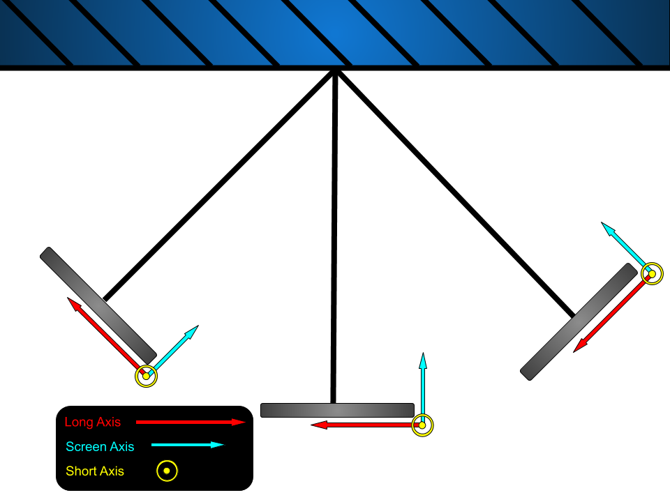
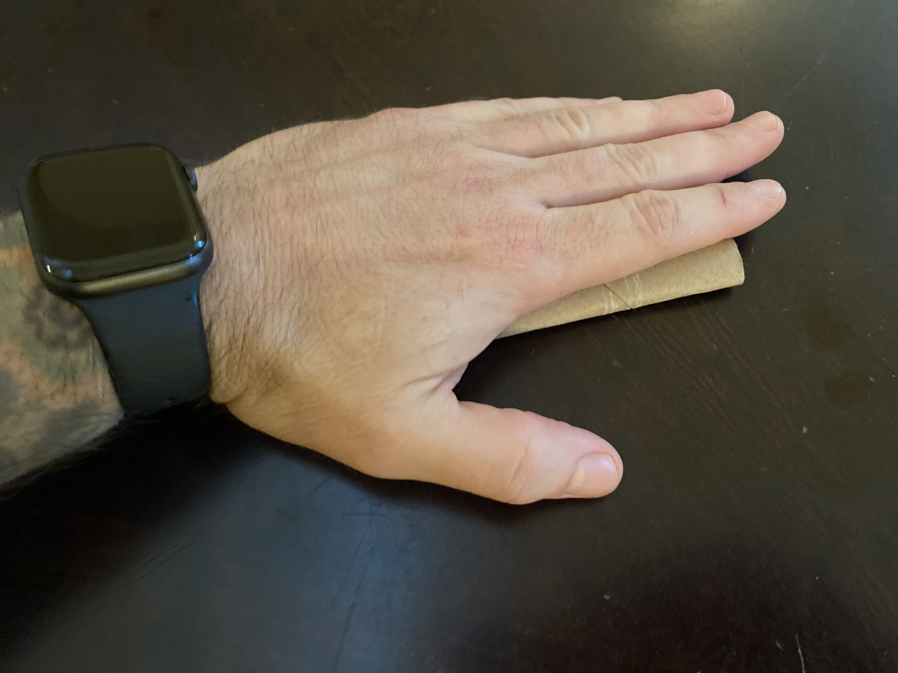
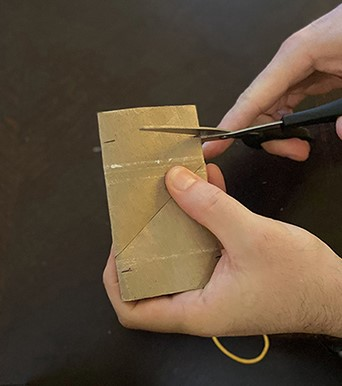
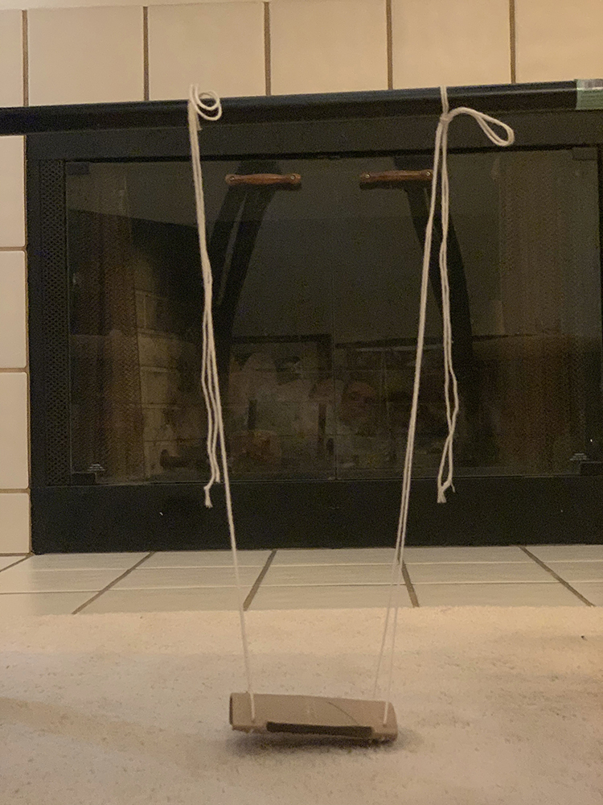

									# Lab 2 Pendulum Week 1
---

### All Materials Needed:

- String, twine, ribbon, or some other type of long, thin, flexible structure for tying and supporting.
- A pair of scissors.
- Someplace to hang your pendulum i.e. shower curtain rod, broomstick across two chairs, taped to a dining room table, etc.
- Phyphox "Acceleration without g”
- Pillow, couch cushion, or something similar.

##### Suggested Additional Materials:
- Toilet paper roll or something similar.
- A rubber band or some other elastic material.
- Tape.

### Lab Goals:

- **Construct an apparatus** 
	- Find a place to **safely** hang your phone.
	- Construct a way of hanging your phone.
- **Data Analysis**
	- Understand the theory of Simple Harmonic Motion.
	- Understand the relationship between period and length.
	- Develop the equations from Newton's equations of motion to verify your data.

---

## Part I: Simple Harmonic Motion

## 1. Review

Simple harmonic motion is characterized by a system whose acceleration is negatively proportional to its position. The following differential equation:
#####
:::Figure:Equation
$$
a = \frac{d^2 x}{dt^2} = -\Omega^2 x
$$
:::
#####
where $x$ is the coordinate for position. $\Omega$ is known as the angular frequency and is defined as the following:
#####
:::Figure:Equation
$$
\Omega = \frac{2 \pi}{T}
$$
:::
#####

 where $T$ is the period of the oscillator. 
 
 
 #####
 **This definition of $\Omega$ is true for all simple harmonic oscillators.**

You maybe have seen Equation 1 solved in a lecture class before. We won't go through it here, but we will remind you that the solution gives position $x$ as function of time  $t$. The equation for position is given in Equation 3 below. 
 
:::Figure:Equation
$$
x = x_0 \cos (\Omega t)
$$
:::

$x_0$ is the amplitude of the periodic motion, but also marks the initial position. 

## 2. Simple Pendulum
[comment]: # (Period is to the length of the pendulum--use this?)

:::Figure:Figure

:::

A simple pendulum is one that is simple a point mass at the at the end of a massless string of length $L$. A simple pendulum that is released from a small initial angle ($15 ^{\circ}$ or less) exhibits simple harmonic motion. For the case of the pendulum it is the angular position given by $\theta$ that follows Equation 1. That is to say:

:::Figure:Equation
$$
\alpha = \frac{d^2 \theta}{dt^2} = -\Omega^2 \theta = -\frac{g}{L} \theta
$$
:::

You may also recall that for a simple pendulum $\Omega = \sqrt{\frac{g}{L}}$, where $g$ is the acceleration due to gravity and $L$ is the length of the pendulum. This has been inserted in Equation 4 above.

Lastly this means that angular position of the pendulum is given by:

:::Figure:Equation
$$
\theta = \theta\small_{0}\normalsize \cos (\Omega t)
$$
:::

:::Question
Use the information above and Equation 2. What is the period of the pendulum?
:::

## 3. Circular Motion

In this experiment you will be using your phone to measure accelerations. Therefore we should discuss what types of accelerations your phone will undergo as it swings back and forth. In a pendulum, the motion of the mass (your phone) moves on an arc of a circle. Therefore we can use our knowledge of circular motion. 

Object moving in a circle are said to have an angular velocity denoted as $\omega$. This angular velocity is defined as the rate of change of the angular position.

:::Figure:Equation
$$
\omega = \frac{d \theta}{dt}
$$
:::

Recall from Physics 2 that the acceleration an object experiences has two components. One points the radial direction (towards the pivot). This we will call $a_{rad}$ or $a_r$ for short. The other points in the direction of motion tangential to the circle. This is sometimes call $a_{tan}$ but for this lab we will call it $a_{\theta}$.

:::Figure:Figure

:::

The equation for both of the accelerations is given below:

:::Figure:Equation
$$
a_{r} = r \omega^2 = r  \left ( \frac{d \theta}{dt} \right )^2
$$
:::

<!-- a_{r} = L\omega^{2}\theta_{0}^{2}\sin^{2}(\omega t) -->

:::Figure:Equation
$$
a_\theta = r \alpha = r  \frac{d^2 \theta}{dt^2}
$$
:::

## Part II: Calculations

## 1. The Experiment

In this lab you will turn your phone into a pendulum. You will suspend it in some way (we provide some ideas below) and then use the "Accelerometer without g" to measure the phone's acceleration along all three axes while your phone swings back and forth. Figure 3 shows one such setup. We will use the acceleration data to measure the period of the pendulum.

:::Figure:Figure

:::

## 2. Relationship Between the Period of Acceleration and Position

Typically when measuring the period of the pendulum you would measure the angular position as a function of time. Then from that data you would measure the period of the pendulum. 

:::Figure:Figure

:::

Since we are measuring the period of the acceleration and not the angular position, we need to understand the relationship between the two. In Figure 4 you can see the how the **net acceleration** vector changes with time. Notice that is periodic. Also notice that at the bottom of the swing it is entirely pointed radially and at the top of the swings it is entirely pointed tangentially. 

This indicates that both $a_r$ and $a_\theta$ have some sort of periodic behavior, but it is not a given that the period of either acceleration would match that of the angular position. We can get some intuition by watching the animation however. Notice that it takes one full swing of the pendulum for $a_\theta$ to point in the same direction while $a_r$ points radially twice in one full swing.

:::Exercise
Assume that the angular position of the pendulum is given by Equation 5 above.

:::Question
Derive the equation for the radial acceleration of the pendulum $a_r$ as a function of time using Equations 5 and 7. Show your work.
:::

:::Question
Derive the equation for the radial acceleration of the pendulum $a_\theta$ as a function of time using Equations 5 and 8. Show your work.
:::

:::Question
a) What is the relationship between the period of $a_r$ and the angular position?

b) What is the relationship between the period of $a_\theta$ and the angular position?

c) Which should you use to measure to angular position of of the pendulum?
:::

Recall that the radial acceleration vector always points towards the pivot. The tangential acceleration points in the direction of motion (tangential to the circular arc). 

Figure 5 shows how the coordinate system for your accelerometer moves with your phone. 

:::Figure:Figure

:::

::: Question
Build a list that identifies which axis of your accelerometer is the long, short, and screen axis, and which of the two correlate to the $a_r$ and $a_\theta$ vectors. 

This is just an example: 

Long Axis is x = $a_r$, etc.
:::
:::

## 3. Is Your Phone a Simple Pendulum?

So far, most of our discussion has been based on a simple pendulum. That means a point mass at the end of  massless string.

Your phone is not a point mass but are we able to treat it like one? The answer is yes, but only under certain conditions. 

You were taught in Physics 2 for a physical pendulum (not a simple pendulum) that the angular frequency is given by:

:::Figure:Equation
$$
\omega_0 = \sqrt{\frac{mgL}{I}}
$$
:::

Where $I$ is the moment of inertia for the physical pendulum.

::: Exercise

:::Question
Verify when we use the moment of inertia for a simple pendulum (point mass) that you get back out the $\Omega$ we expect.
:::

To figure out the moment of inertia for your phone we will need to do two things. 

1. First we will assume that your phone has the same moment of inertia as a bar rotating about its center. This is given by:

:::Figure:Equation
$$
I_{phone-cm} = \frac{1}{12}ml^2
$$
:::

Where $l$ is the length of one of the edges of your phone.

2. The equation for $I_{phone-cm}$ only works for rotating your phone about its **center of mass**. For our setup, your phone will not be rotating about its center of mass, but about the pivot of the pendulum. To get the moment of inertia about the pivot we will have to apply the parallel axis theorem.

::: Question
Use the parallel axis theorem and equation 10 to write the equation moment of inertia of your phone about the pendulum pivot. Though some of you may prefer Android, call it $I_{phone}$.
:::

3. Now that you have the moment of inertia for your phone, plug it into Equation 9.
4. Factor out $mL^2$ from the denominator. 

:::Question
a) Under what condition does your phone behave like a simple pendulum. **Hint: Consider the ratio of $\frac{l}{L}$.**

b) If your phone had a length of 8cm and the pendulum a length is 50cm,  What is the percent difference between the period of a perfect pendulum of 50cm, and your phone pendulum. 
:::
:::

<!--##### Background
A period is the time it takes for one cycle in a repeating event. It is the time for which the event repeats itself. A pendulum at rest is considered to be in equilibrium. Once the pendulum is displaced, it oscillates about the equilibrium position. The duration of time from the position of displacement after it is released and back to that position is the period.

We want to make the correction term (the term due to rotation) as small as possible so given that your phone is X cm long, what length of string would you like to make your pendulum?)-->

# Part III: Building an Apparatus
In this experiment you will be using your phone to measure the acceleration in the x, y, and z axis without gravity. 
While you may be able to achieve a pendulum without it, we recommend using the additional materials as well. This guide will assume that you have them.

:::Figure:Figure

:::

[INSERT ANIMATED GIF HERE]
1. Find the cardboard tube from a toilet paper roll and flatten it.  

:::Figure:Figure

:::

3. mark the width of your phone on both sides of the flatted tube.
:::Figure:Figure

:::

4. Cut into the roll approximately 4 cm deep at each mark you made using your phone. Cut along the length of the roll to complete the cutout. Do this on both sides.
:::Figure:Figure

:::

5. Poke holes in each of the corners of the now flattened roll, leaving enough space along the edge that you don’t rip out to the edge.
:::Figure:Figure

:::

:::Figure:Figure

:::

:::Figure:Figure

:::

7.  Now cut a long length of string. Make sure you leave a lot of slack, too. This string will run through the width edge, run underneath the roll, then back through and up the other width edge hole.

:::Figure:Figure

:::

9.  Now find something to hang your string from. I have used both a shower frame as well as a broom handle between two chairs.
:::Figure:Figure

:::

:::Figure:Figure

:::

11. 

Ex 3
Build apparatus. Take pic. Take data. 
PUT DISCLAIMER ABOUT SECURING PHONE/PILLOWS/EVERYTHING

# Part IV: Conclusion
::: Exercise
1. Give a quick summary of the import parts of this lab.
:::