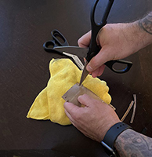

# Lab 2 Pendulum Week 2
---

### Required Materials:

- String, twine, ribbon, or some other type of long, thin, flexible structure for tying and supporting
- A pair of scissors
- Somewhere to hang your pendulum, *e.g.*, shower curtain rod, broomstick across two chairs, taped to a dining room table, etc.
- phyphox &ldquo;Acceleration without g.&rdquo;
- Pillow, couch cushion, or something similar

##### Suggested Additional Materials:
- Toilet paper roll or something similar
- A rubber band or some other elastic material
- Measuring tape
- Tape

### Lab Goals:

- **Construct an apparatus** 
- Construct a method of suspending your phone
- Find a place to **safely** hang your phone
- **Data Analysis**
	- Understand the theory of Simple Harmonic Motion
	- Understand the relationship between period and length
	- Develop the equations from Newton's equations of motion to verify your data

---

# Part III: Building an Apparatus

:::row
:::column
:::Figure:Figure

:::
:::
:::column
:::Figure:Figure

:::
:::
:::

:::Note
DISCLAIMER - You will be using your phone to take data, and this can sometimes lead to accidents. **Please use due care in handling your phone during this experiment.**
:::

<!---[INSERT ANIMATED GIF HERE]--->

In this experiment you will be using your phone to measure the acceleration in the x, y, and z axes without gravity. You will build an apparatus and take data. Include a picture of your setup if you can!

While you may be able to achieve a pendulum without them, we recommend using the additional materials as well. This guide will assume that you have them.

:::Figure:Figure

:::

1. Find the cardboard tube from a toilet paper roll and flatten it.  
<!---:::Figure:Figure:::--->

2. Mark the width of your phone on both sides of the flattened tube.
<!---:::Figure:Figure:::--->

3. Make a cut, approximately 4 mm deep, at each mark you made with your phone. Cut from one mark to the other, along the length of the roll, to complete the cutout. Do this on both sides.

:::Figure:Figure

:::

4. Poke holes in each of the corners of the flattened roll, leaving enough space along the edge that you don’t rip out to the edge.

:::row
:::column
:::Figure:Figure

:::
:::
<!---:::Figure:Figure:::--->

:::Figure:Figure

:::
:::

5.  Now cut a long length of string. Make sure you leave a lot of slack, too. This string will run through the width edge, run underneath the roll, then back through and up the other width edge hole.

:::Figure:Figure

:::

6.  Insert your phone into the whole you have cut, with the string ends on the same side as your phone face. Put a rubber band, or something else elastic, around one end of the phone (while the roll is at that end). Slide the roll and elastic band to the other side, so you can fir it around there too. This will secure your phone even more.

:::Figure:Figure

:::

7.  Now find something from which to hang your string. I have used both a shower frame and a broom handle set between two chairs.

:::row
:::column
:::Figure:Figure

:::
:::

:::Figure:Figure

:::
:::

8. If your phone is not level, try corrective measures.

:::row
:::column
:::Figure:Figure

:::
:::

:::Figure:Figure

:::
:::

Note: I added tape after the second photo to ensure that everything would stay in place.

# Part IV: Experiment

##### Background
A period is the time it takes for one cycle in a repeating event or the time for which the event repeats itself. 
#####
A pendulum at rest is considered to be in equilibrium. Once the pendulum is displaced, it oscillates about the equilibrium position. The duration of time from the position of displacement after it is released and back to that position is the period of the pendulum.
#####
You should have determined by now how you will be turning your phone into a pendulum.
#####
Typically, when measuring the period of the pendulum, you would measure the angular position as a function of time. Then from those data you would calculate the period of the pendulum. 
##### 
(very rough) Did you know that the clock was invented after the discovery of Simple Harmonic Motion? Simple Harmonic Motion also is how musicians keep time with one another.
#####
<!---This was an idea I had for showing the same thing but with a pendulum...alas, I could not find it...
#####
-->
#####
#

:::Exercise
In order to accurately measure the length of your pendulum, we will need to figure a method for determining that. 

If you have a measuring tape, use one end at the point of the pivot and then measure straight downward to the center of mass of your phone. 

If you do not have a measuring tape but have a ruler, cut a piece of string that you will dangle from the surface of the pivot to your phone in a straight downward line. 

You are free to use either of those methods. However, if you have access to neither of those methods, or another method of your choosing, then we will have to use trigonometry to solve this problem. 
#####
First, we suggest that you keep your string lengths perpendicular to the floor, i.e. from the front view, you do not want them flaring out or in, but rather straight up. This will make things a little easier. Secondly, you will need to calculate two projections of the length in order to use the Pythagorean theorem to determine the effective length of your pendulum.
:::Note
Please note; if you *are* using a measuring device of some kind make sure the resolution of the measurement is appropriate.
:::
Measure the length of your pendulum in meters.
#####
:::Figure:Figure

:::
<!---Print a ruler from an online source or use a money. A dollar bill is 6" long and if you need something smaller, a quarter is 1 inch.--->
:::

:::Exercise
<!---ex 1 take your data put it in table that makes sense, calculate g (10 periods, divide by 10).--->
1. Make a table. Be sure to include things like mass, m, length, l, period, T, as well as the initial angle, $\theta$ (you only need approximate this).

:::Figure:Table

| mass, m | length, l | Period, T | Initial Angle, $\theta$ |
| -------- | -------- | -------- |---|
|     |     |     |     |

:::

2. Look up the mass of your phone online. Record the value in your table.
3. Measure the length of your pendulum (exercise 1). Record the value in your table.
4. Approximate a small displacement from equilibrium in which you will start your pendulum. Record this angle in your table.
5. Using the 'Accelerometer without g' experiment and tap ⋮ to go to 'Timed Run'. Chose an appropriate start delay (first blank) and experiment duration (second blank) to get cleaner data. 

:::Question

:::
:::

# Part V: Data Analysis 
<!---ex 2 get everyone's data, plot it, do a power fit. check that it matches theory-->

:::Exercise
7. Determine which axis has the appropriate data and calculate the average for one period. Use upwards of 10 periods or more.
8. Create a spreadsheet and import the data from your phone--this is easily done by sending the data from your phone in an email to yourself. 
:::Question:
Some Question here about their plot or data collected
#####
a) What is the period?
#####
b) What is g?
#####

#####
-Does the period significantly depend on the length? Why? Justify your answer.
#####
:::
::: 
:::Exercise
Length = X
1. Make a new apparatus or re-use your old one using the given length.
2. Fill out this form (or sheet) to submit your 'Acceleration without g' data in order to average one period using the results of all the students in your section.
3. mass question
:::

:::Exercise

5. It is very hard to make analytical comparisons unless we linearize.  Plot this data and perform a power curve fit

6. Calculate g based on the resulting average of one period for the given length.

:::Question
Even though you only took data for one initial angular displacement and one mass, answer the following questions (based on your intuition?)
#####
Does the period significantly depend on the mass? Why? Justify your answer.
#####
Based on the average of one period, what is g?
:::
:::

<!---ex 3 linearize it. show linest video. "this is your error now, on your slope", translate it into error in g. how does that value compare to your known g?--->

# Part VI: Conclusion
::: Exercise
1. Describe the experiment you will be performing next week.

2. Briefly state how the acceleration you will measure will be related to the period of the pendulum.

3. Summarize how using your phone as the bob affects your pendulum.
	:::