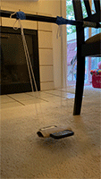

# Lab 2 Pendulum Week 2
---

### Required Materials:

- String, twine, ribbon, or some other type of long, thin, flexible structure for tying and supporting
- A pair of scissors
- Somewhere to hang your pendulum, *e.g.*, shower curtain rod, broomstick across two chairs, taped to a dining room table, etc.
- phyphox “Acceleration without g.”
- Pillow, couch cushion, or something similar

##### Suggested Additional Materials:
- Toilet paper roll or something similar
- A rubber band or some other elastic material
- Measuring tape
- Tape

### Lab Goals:

- **Construct an apparatus** 
- Construct a method of suspending your phone
- Find a place to **safely** hang your phone
- **Data Analysis**
	- Understand the theory of Simple Harmonic Motion
	- Understand the relationship between period and length
	- Develop the equations from Newton's equations of motion to verify your data

---

# Part III: Building an Apparatus

:::row
:::column
:::Figure:Figure

:::
:::
:::column
:::Figure:Figure

:::
:::
:::

:::Note
DISCLAIMER - You will be using your phone to take data, and this can sometimes lead to accidents. **Please use due care in handling your phone during this experiment.**
:::

<!---[INSERT ANIMATED GIF HERE]--->

In this experiment you will be using your phone to measure the acceleration in the x, y, and z axes without gravity. You will build an apparatus and take data. Include a picture of your setup if you can!

While you may be able to achieve a pendulum without them, we recommend using the additional materials as well. This guide will assume that you have them.

:::Figure:Figure

:::

1. Find the cardboard tube from a toilet paper roll and flatten it.  
<!---:::Figure:Figure:::--->

2. Mark the width of your phone on both sides of the flattened tube.
<!---:::Figure:Figure:::--->

3. Make a cut, approximately 4 mm deep, at each mark you made with your phone. Cut from one mark to the other, along the length of the roll, to complete the cutout. Do this on both sides.

:::Figure:Figure

:::

4. Poke holes in each of the corners of the flattened roll, leaving enough space along the edge that you don’t rip out to the edge.

:::row
:::column
:::Figure:Figure

:::
:::
<!---:::Figure:Figure:::--->

:::Figure:Figure

:::
:::

5.  Now cut a long length of string. Make sure you leave a lot of slack, too. This string will run through the width edge, run underneath the roll, then back through and up the other width edge hole.

:::Figure:Figure

:::

6.  Insert your phone into the whole you have cut, with the string ends on the same side as your phone face. Put a rubber band, or something else elastic, around one end of the phone (while the roll is at that end). Slide the roll and elastic band to the other side, so you can fir it around there too. This will secure your phone even more.

:::Figure:Figure

:::

7.  Now find something from which to hang your string. I have used both a shower frame and a broom handle set between two chairs.

:::row
:::column
:::Figure:Figure

:::
:::

:::Figure:Figure

:::
:::

8. If your phone is not level, try corrective measures.

:::row
:::column
:::Figure:Figure

:::
:::

:::Figure:Figure

:::
:::

Note: I added tape after the second photo to ensure that everything would stay in place.

# Part IV: Experiment

##### Background
A period is the time it takes for one cycle in a repeating event or the time for which the event repeats itself. 
#####
A pendulum at rest is considered to be in equilibrium. Once the pendulum is displaced, it oscillates about the equilibrium position. The duration of time from the position of displacement after it is released and back to that position is the period of the pendulum.
#####
You should have determined by now how you will be turning your phone into a pendulum.
#####
Typically, when measuring the period of the pendulum, you would measure the angular position as a function of time. Then from those data you would calculate the period of the pendulum. 
#

:::Exercise
1. Make a table. Be sure to include things like mass, m, length, l, period, T, as well as the initial angle, $\theta$ (you only need approximate this)

:::Figure:Table

| Column 1 | Column 2 | Column 3 | Zak added Column |
| -------- | -------- | -------- |---|
| Text     | Text     | Text     | Hi |

:::

3. Look up the mass of your phone online. Record the data (alternately they can grab some things from the kitchen with weight listed on them and create a balance -- this link here is for anything we may need to weigh in the future: https://www.hunker.com/13414006/how-to-weigh-things-without-a-scale
4. Measure the length of your pendulum (AVOCADO come back to this). Print a ruler from an online source or use a money. A dollar bill is 6" long and if you need something smaller, a quarter is 1 inch.
5. measure small angle for one length
6. Using the 'Accelerometer without g' function (and we find making it a timed run gives a lot of data and the ability to start the pendulum in motion before recording starts).
7. Determine which axis you will be using and calculate the averaged measured period using ~10 periods.
8. Create a Google Sheet and import your data from your phone--this is easily done by sending the data from your phone in an email to yourself). Plot your data.
9. Determine which axis you will be using and calculate the averaged measured period using ~10 periods.
10. Fill out this form to submit the data for your classes total data.

:::Question:
Some Question here about thier plot or data collected
:::
:::

# Part V: IDR

# Part VI: Conclusion
::: Exercise
1. Describe the experiment you will be performing next week.

2. Briefly state how the acceleration you will measure will be related to the period of the pendulum.

3. Summarize how using your phone as the bob affects your pendulum.
:::