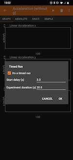

# Lab 2 Pendulum Week 2
---

### Required Materials:

- String, twine, ribbon, or some other type of long, thin, flexible structure for tying and supporting
- A pair of scissors
- Somewhere to hang your pendulum, *e.g.*, shower curtain rod, broomstick across two chairs, taped to a dining room table, etc.
- phyphox &ldquo;Acceleration without g.&rdquo;
- Pillow, couch cushion, or something similar

##### Suggested Additional Materials:
- Toilet paper roll or something similar
- A rubber band or some other elastic material
- Measuring tape
- Tape

### Lab Goals:

- **Construct an apparatus** 
- Construct a method of suspending your phone
- Find a place to **safely** hang your phone
- **Data Analysis**
	- Understand the theory of Simple Harmonic Motion
	- Understand the relationship between period and length
	- Develop the equations from Newton's equations of motion to verify your data

---

# Part III: Building an Apparatus

:::row
:::column
:::Figure:Figure

:::
:::
:::column
:::Figure:Figure

:::
:::
:::

:::Note
DISCLAIMER - You will be using your phone to take data, and this can sometimes lead to accidents. **Please use due care in handling your phone during this experiment.**
:::

<!---[INSERT ANIMATED GIF HERE]--->

In this experiment you will be using your phone to measure the acceleration in the x, y, and z axes without gravity. You will build an apparatus and take data. Include a picture of your setup if you can!

While you may be able to achieve a pendulum without them, we recommend using the additional materials as well. This guide will assume that you have them.

:::Figure:Figure

:::

1. Find the cardboard tube from a toilet paper roll and flatten it.  
<!---:::Figure:Figure:::--->

2. Mark the width of your phone on both sides of the flattened tube.
<!---:::Figure:Figure:::--->

3. Make a cut, approximately 4 mm deep, at each mark you made with your phone. Cut from one mark to the other, along the length of the roll, to complete the cutout. Do this on both sides.

:::Figure:Figure

:::

4. Poke holes in each of the corners of the flattened roll, leaving enough space along the edge that you don’t rip out to the edge.

:::row
:::column
:::Figure:Figure

:::
:::
<!---:::Figure:Figure:::--->

:::Figure:Figure

:::
:::

5.  Now cut a long length of string. Make sure you leave a lot of slack, too. This string will run through the width edge, run underneath the roll, then back through and up the other width edge hole.

:::Figure:Figure

:::

6.  Insert your phone into the whole you have cut, with the string ends on the same side as your phone face. Put a rubber band, or something else elastic, around one end of the phone (while the roll is at that end). Slide the roll and elastic band to the other side, so you can fir it around there too. This will secure your phone even more.

:::Figure:Figure

:::

7.  Now find something from which to hang your string. I have used both a shower frame and a broom handle set between two chairs.

:::row
:::column
:::Figure:Figure

:::
:::

:::Figure:Figure

:::
:::

8. If your phone is not level, try corrective measures.

:::row
:::column
:::Figure:Figure

:::
:::

:::Figure:Figure

:::
:::

Note: I added tape after the second photo to ensure that everything would stay in place.

# Part IV: Experiment

##### Background
A period is the time it takes for one cycle in a repeating event or the time for which the event repeats itself. 
#####
A pendulum at rest is considered to be in equilibrium. Once the pendulum is displaced, it oscillates about the equilibrium position. The duration of time from the position of displacement after it is released and back to that position is the period of the pendulum.
#####
You should have determined by now how you will be turning your phone into a pendulum.
#####
Typically, when measuring the period of the pendulum, you would measure the angular position as a function of time. Then from those data you would calculate the period of the pendulum. 
##### 
(very rough) Did you know that the clock was invented after the discovery of Simple Harmonic Motion? Simple Harmonic Motion also is how musicians keep time with one another.
#####
<!---This was an idea I had for showing the same thing but with a pendulum...alas, I could not find it...
#####
-->
#####

:::Exercise
In order to accurately measure the length of your pendulum, we will need to figure a method for determining that. 

If you have a measuring tape, use one end at the point of the pivot and then measure straight downward to the center of mass of your phone. 

If you do not have a measuring tape but have a ruler, cut a piece of string that you will dangle from the surface of the pivot to your phone in a straight downward line. 

You are free to use either of those methods. However, if you have access to neither of those methods, or another method of your choosing, then we will have to use trigonometry to solve this problem. 
#####
First, we suggest that you keep your string lengths perpendicular to the floor, i.e. from the front view, you do not want them flaring out or in, but rather straight up. This will make things a little easier. Secondly, you will need to calculate two projections of the length in order to use the Pythagorean theorem to determine the effective length of your pendulum.
:::Note
Please note; if you *are* using a measuring device of some kind make sure the resolution of the measurement is appropriate.
:::
Measure the length of your pendulum in meters.
#####
:::Figure:Figure

:::
:::

::: Exercise

In this exercise you will use Phyphox to collect acceleration data from you phone while it is swinging.

1. Make a table. Include the following quantities in the header of the table: mass $m$, length $L$, period $T$.

:::Figure:Table

| Mass [kg] | Length [m]| Period [s] | 
| -------- | -------- | -------- |
|  -  |  -   |  -   | 

:::

2. Look up the mass of your phone online. Record the value in your table. Make sure to use the correct units. 
3. Using the "Accelerometer **without** g" experiment and tap ⋮ to go to "Timed Run". Chose an appropriate start delay (first blank) and experiment duration (second blank & about 15-20 secounds). Now, when you hit play, the phone will wait the set amount of time to start collecting data and then only collect data for the time you set. This will allow you get a nice run of data and not have to do any trimming later.

:::Figure:Figure

:::

5. Displace the phone by a small amount (something like $15^{\circ}$), hit play, and then release your phone.
6. Let it swing for the time you set in Step 3 and then look at your data. 
7. Ensure that the data looks good (see notes below), and that you have 10 or more periods before exporting it.
8. When you are ready, export the data to a spreadsheet.

:::Note
"Good" data is hard to define. You might just try taking a couple runs to see what type of data comes out. You should however be able to make *some* predictions about what good data should look like.

Recall that $a_\theta$ should look like $\cos(\Omega t)$ while $a_r$ should look like $\sin^2 (\Omega t)$. Thus you should hope to see things like $a_r$ has half roughly the period of $a_{\theta}$. You should notice that $a_{\theta}$ oscillates about $0$ while $a_r$ is almost entirely positive. Your final axis shouldn't have much on it). It is unlikely that you will get perfect data (i.e. exact cosine and sine squared functions), but should see these sort of trends.
:::

:::Note
Pay attention to the vertical axis scaling on your three plots. They won't all be the same so you shouldn't directly compare your three graphs to each other without first rescaling or noting the difference in scales.
:::
:::

# Part V: Data Analysis 
<!---ex 2 get everyone's data, plot it, do a power fit. check that it matches theory-->

:::Exercise
We want to determine the period, $T$, of the oscillations of motion. We will do so by looking at the oscillatory behavior of the accelerations recorded by the phone in the three different directions. Remember your derivations from Week 1 to determine the relationship between the periods of the accelerations in the different directions and the period  $T$ of motion of the pendulum.

1. Create a spreadsheet and import the data from your phone.

:::Question

a) How do the periods of the accelerations measured by the phone compare to the period of oscillations of the pendulum?

b) Which axis has the same period as the period of motion?
:::

2. Find the period of motion of the pendulum by measuring the average period of the acceleration with the same period as the period of motion (your answer from the previous question). 
To find the average period, measure the time it takes the pendulum to complete 10 periods and divide by the number of periods (in this case 10). This will reduce the error in your measurement. If your data only displays 8 or 9 periods , that works as well.

:::Question
What is the average period of motion?
:::

Remember the period $T$ is determined by the length of the pendulum $L$ and the acceleration due to gravity $g$. 

:::Figure:Equation
$$T=2\pi \sqrt{\frac{L}{g}}$$
:::

3. Rewrite the Equation 1 to find $g$ in terms of $L$ and $T$.
2. Given your value of $L$ measured earlier and of $T$ which you found from the acceleration data, determine the value of $g$.
3. Find the percent discrepancy between the value you found for $g$ and the accepted value of $9.806 m/s^2$.

:::Question
a) What is the value of $g$ from your measurements?

b) What is the percent discrepancy you recorded?
:::
:::

:::Exercise

In this exercise you will be submitting your data in a Google form that will be collected into one larger dataset with all the students in your class. You will then begin to analyze how the period of the pendulum is related to its length.
Submit you data in the form linked in the table below. Make sure the mass you provide is in **kilograms**, the length is in **meters**, and the period is in **seconds**. **Also make sure that you select your correct section!**

:::Figure:Table
| Google Form |
| -------- |
| [Link To Form](https://docs.google.com/forms/d/e/1FAIpQLSdMNOtqqm2KSdf8FQLNO5scZo3EIxxJ9WP1eJ9lRgUUMas-0g/viewform)     |
:::

::: Note
Wait until your TA gives you to okay to proceed. You'll need enough data collected to make a usable set of data. 
:::

1. Now that you and your classmate's data has been collected you can proceed. Copy the data set into a spreadsheet where you can do your work and create a plot of period as a function of length.
2. Now that you and your classmate's data has been collected you can proceed.
3. Copy the data set into a spreadsheet where you can do your work.
4. Create a plot of period as a function of length.

You will want to perform a curve fit on this data, but it may not be obvious what function to use? The answer lies in our theory and therefore, Equation 1. If you were to abstract Equation 1 we may write it like the following:

:::Figure:Equation
$$
T(L) = A\left( \frac{L}{B}\right)^C=\left(\frac{A}{B^C}\right)L^C=DL^C
$$
:::

In the first equivalence we have replaced all the constants in Equation 1 with variables. Note: the square root is the same as raising something to the 1/2 power, hence $C$. Then in the second equivalence we took everything that is a constant and put it together. Finally, in the last line we replaced the group of constants (which is a constant) with a new constant named $D$. 

Thus we can see that a generic form of our equation is a power law. Google allows us to do this by selecting our trend line as "Power Series" which is a bit of a misnomer. Figure 15 shows where to the function to select. 

:::Figure:Figure

:::

5.  Perform the power law fit to your data and display the equation. Make sure to properly label the axes and title the graph.

:::Question
Is this a good fit for the data? What makes it a good fit?
:::

:::Question
a) What is the value for the fitting parameter $C$?

b) Does this appear to fit well with the theory described in Equation 1? Why or why not?
:::

:::Question
a) What is the value of the fitting parameter $D$?

b) What do you think the meaning of this parameter is?
:::

:::

In the last exercise you demonstrated how the period of the pendulum relates to its length. Hopefully you saw that a power law fit matches pretty well with the theory we developed last week. Determining the quality of a non-linear curve fit quantitatively can be very challenging and is beyond this class.

It is possible, though, to analyze a **linear** fit quantitatively. There are some semi-complicated equations that tell use what the uncertainty in the slope and intercept is for a linear fit. We won't worry about the details of those here but we will just use google sheets' "LINEST" function. 

LINEST is short for Linear Estimation. It will use the method of least squares to make a best estimation of the line that fits your data.

Below is a video that shows you how use the LINEST function in Google Sheets and how to get the slope, the uncertainty in the slope, the intercept, and the error in the intercept.

:::Figure:Video
!(https://www.youtube.com/watch?v=wkqlSuAoFLQ)
:::

:::Exercise

In this exercise we will **linearize** the class data so that we can fit a line to the data and make a quantitative judgment about the experiment.

To linearize an equation you must perform a mathematical operation on your equation so that the independent variable is linear. That is, it appears once and is to the first power. While performing the linearization to the independent variable you track the mathematical operations done to the dependent variable. You then apply those to the operations to the dependent variable to generate a new equation that is linear. 

For this lab, $L$ is your independent variable and $T$ is your dependent variable. If you square both sides of Equation 1 you will have a function, $T^2$ that is linear in $L$.

:::Question
Linearize Equation 1. What is the new equation?
:::

1. Make a new column in you spreadsheet. In this column square each of the period measurements. 
2. Create a new plot  of $T^2$ vs $L$.
3. Add a linear trendline and use the LINEST function to get the uncertainties for the slope an intercept.

:::Question
a) What is the value of the slope? Make sure to include the units and uncertainty.

b) Based on your response in Question 7, what should the slope be?
:::

:::Question
Use the slope to determine a value for $g$.
:::

Determining the uncertainty in $g$ is slightly more complex then just using the uncertainty in the slope provided by LINEST. Because the slope is exactly equal $g$ the uncertainties aren't exactly equal either. To determine the uncertainty you must **propgate** it from $m$ to $g$. This is another topic that we will save the details for later, but for now we will just state that the uncertainty in $g$, denoted $\delta g$ is related to the uncertainty in the slope $\delta m$ in the following way:

:::Figure:Equation
$$
\delta g = 4 \pi^2 |g| \left(\frac{\delta m}{|m|}\right)
$$
:::

:::Question
a) What is the value you measured for $g$ with the uncertainty?

b) Does the accepted value of $g$ fall within your window of uncertainty?

c) Does this strengthen the theory? Why or why not?
:::

5. Find the percent discrepancy between the value you found for $g$ and the accepted value of $9.806 m/s^2$.
:::Question
What is the value of $g$ and the percent discrepancy you recorded?
:::
:::

:::Exercise
1 . In this experiment we used small angles in order to capitalize on the small angle formula. This allowed us to bypass many more advanced mathematics and study simple harmonic motion.
We also never varied the mass of the pendulum. Even though you only took data for one initial angular displacement and one mass, answer the following questions using your intuition.
:::Question
a. Does the period significantly depend on the mass? Why? Justify your answer.
b. Based on the average of one period, what is g?
:::  

:::

<!---ex 3 linearize it. show linest video. "this is your error now, on your slope", translate it into error in g. how does that value compare to your known g?--->

# Part VI: Conclusion
:::Exercise
Write a brief conclusion summarizing the import parts of this lab. **Hint:** Briefly summarize each exercise, and where appropriate, how they logically fit together. 
:::