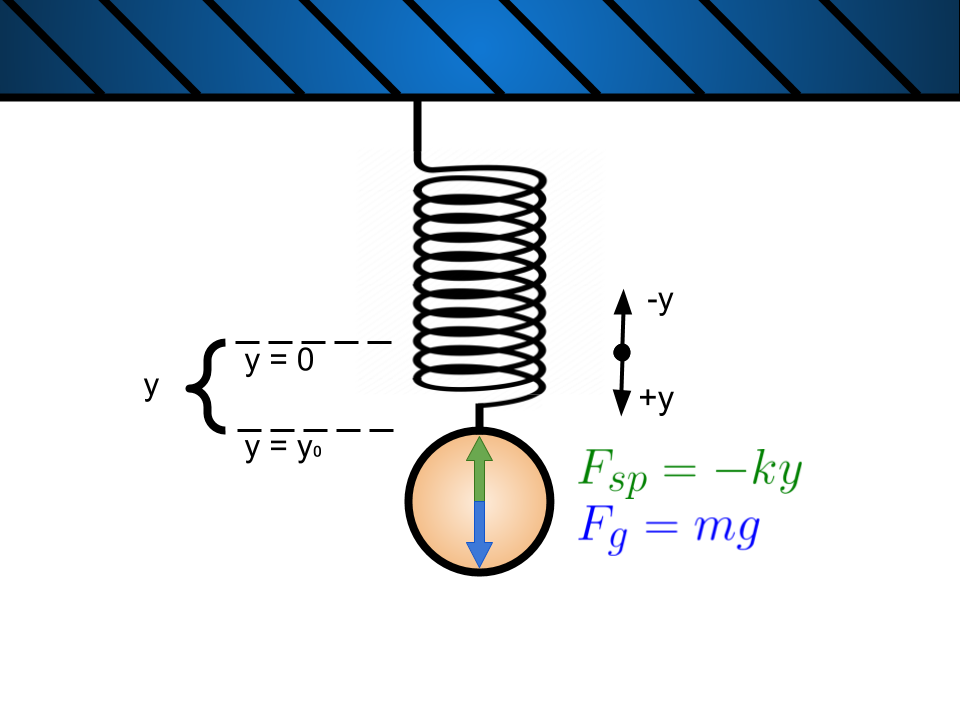
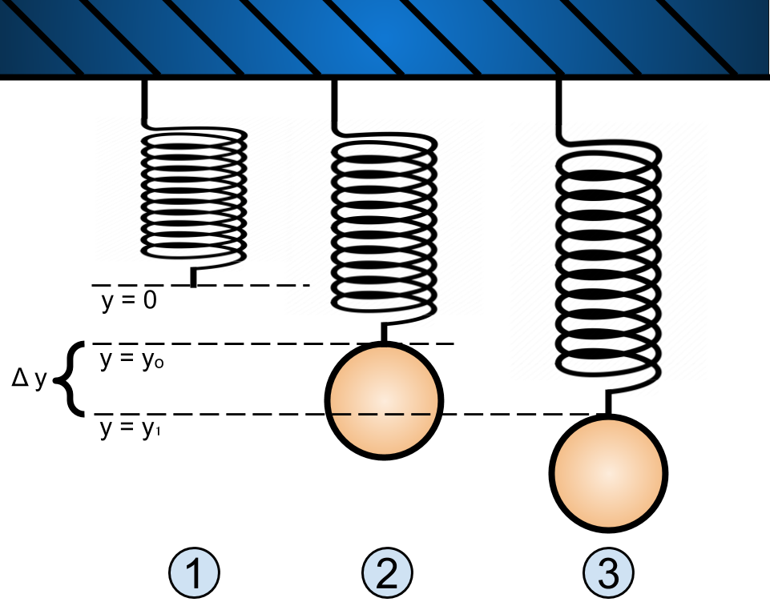

# Lab 3: Simple Harmonic Motion Week 1
---
### All Materials Needed:
- Two kinds of rubber bands
- Ziplock bag
- Paperclip
- Household baking goods and measuring cups, coins, batteries, or other objects of known masses.
- Scissors
- Tape
- Measuring tape or meter stick
- Pillow, couch cushion, or something similar.
- Somewhere to hang your spring, e.g., shower curtain rod, broomstick across two chairs, large table, etc. 
- Phyphox "Acceleration (without g)" preferred, or "Acceleration (with g)".

### Optional Materials

-Zip ties

-Super glue

### Lab Goals:
- ** Construct an apparatus **
	- Find two rubber bands of different widths.
	- Find a surface and location to hang your masses from; such as a table, shower rod, broom, etc.
- ** Data Analysis **
	- Understand the theory behind Hooke's Law.
	- Generate the equations that will be used to process the data.
	- Prepare spreadsheet for data analysis.

---

# Part I: Hooke's Law

Most springs obey Hooke's Law: the magnitude of the force  the spring exerts is proportional to the amount it is stretched. This is mathematically expressed as: 

:::Figure:Equation
$$
F_{sp} = -k\Delta y
$$
:::

Where $F_{sp}$ is the force exerted by the spring, $\Delta y$ is the displacement from the springs equilibrium position, and $k$ is the spring constant. The larger the spring constant $k$, the "stiffer" the spring.  As a matter of fact, the constant $k$ is often referred to as the stiffness.

For the purpose of the lab we will define the origin, the zero point, as spot at the end of the spring when it is hanging in its relaxed state. See Figure 1 below.

:::Figure:Figure

:::

Hooke's law is an excellent description for spring buy often times applies to more than just springs. It is also sometimes accurate when dealing with elastic materials such as rubber bands. 

If we were to hang a mass, $m$, from a rubber band and wait for the system to come to equilibrium (stop moving) we could determine the spring force by using Newton's second law and the force of gravity. 

:::Figure:Figure

:::

We will define the downward direction as positive. See Figure 2 for a free body diagram. Putting this together we have:

:::Figure:Equation
$$
\sum F = F_{sp}+F_g = F_{sp}+mg =0 \\
\implies F_{sp}=-mg
$$
:::

Where in the first line of the equation we recognized that for a system in equilibrium the acceleration is zero.

Thus we can use the mass and gravity to measure the spring force. From this we can measure the spring constant of the rubber band.

:::Question
Use Equation 1 and Equation 2 to write the equation for the spring constant.
:::

### The First Experiment

:::Figure:Figure

:::

A better way to determine the spring constant would be to very the mass and measure the stretch. From many data point we could create a plot and perform a fit.

For this lab you will hang a Ziploc bag on a rubber band then add mass to the bag. You will measure the length of the rubber band as you add more and more mass.

:::Question
a) Rewrite your answer to Question 1 to have stretch, $y$, as a function of mass $m$.

b) If you were to create the plot of stretch vs mass, what is the expression for the slope?

c) How does the slope change with stiffness of the spring or rubber band?
:::

# Part II: Springs in Motion (More Harmonic Motion)

Another way to determine the spring constant is to hang a single mass from the spring. If you were to displace the mass from its equilibrium position slightly and release you would see the mass oscillate around the equilibrium position. This should sound **very** familiar.

In fact, this is another form of a simple harmonic oscillator. 

In order show this mathematically we must first determine the net force on the mass when it is slightly displaced. 

:::Figure:Figure

:::

Figure 4 shows the mass in three different positions labeled 1, 2, and 3. Position 1 shows the unstretched spring. Position 2 is the mass in its equilibrium position which is what we will call the zero position. Position 3 shows the mass when it has been displaced by an amount $y$ from equilibrium. 

We already know that in position 2 the spring force is given by:

:::Figure:Equation
$$
F_{sp2} = ky = mg = 0
$$
:::

Then, if you look at the net force on the mass in position three you would see :

:::Figure:Equation
$$
\sum F = -ky+mg \\

= -ky
$$
:::

In the above we used the fact that $y=0$ for position 2.

:::Question
Use Newton's second law and Equation 4 to determine acceleration felt by the mass, $a_y$. 
:::

:::Question
Is the oscillating mass a simple harmonic oscillator? Use your response to question 3 to help justify your answer. **Hint:** Look back ad Lab 2 Week 1 if you need help.
:::

:::Question
a) What is the expression for the angular frequency, $\Omega$, of this simple harmonic oscillator?

b) What is the period of oscillation?
:::

::: Question
a) For a given mass, a stiffer spring causes greater of lesser frequency? Period?

b) Why do you think that mass increases the period? Hint: Thing about this in terms of $F=ma$
:::

## The Second Experiment

The second experiment for next week will involve you putting your phone in the Ziploc bag and then setting it in motion. You will use the "Acceleration without g" to measure the acceleration experienced by your phone. You will then use the acceleration to measure the period and the spring constant and the rubber band.

## Building Your Lab

In this lab you will be mounting a rubber band to a horizontal surface for two exercises. The first exercise will require you to attach a variety of masses to your rubber band, and the second will require you to attach your phone to your rubber band. Figure Guac shows a possible set up, the set up for both exercises will be similar.

Similar to the pendulum, we typically talk about the period of the position and not the acceleration. You will be measuring acceleration. Since we know the mass on a spring is also a simple harmonic oscillator we know the position as a function of time looks like the following:
:::Figure:Equation
$$
y = \Delta y \sin(\Omega t)
$$
:::
:::Question
Does the acceleration experienced by the mass have the same period as the position? Justify your answer. 
:::

:::Exercise 
In this experiment you will be using some masses and your phone to measure characteristics of simple harmonic motion. You will build an apparatus and take data for analysis. Be sure to include a picture of your set up if you can!

The process of building your spring AVO experiment will be similar to the apparatus you made in your previous lab: Pendulum. You can also build this with many different variations. Please read through all of the instructions before considering alternate steps.

1. Collect all of the materials you will need for this set up: rubber bands, tape, paper clips, scissors, zip-lock bags, makeshift weights (sugar, flour, salt, cornstarch, coins).

2. Find the location where you will build your apparatus. You should be fine with building this wherever you build your pendulum from the previous lab.

:::Figure:Figure

:::

In this lab you will have your phone oscillating on a rubber band, so you will want to make sure your phone is not suspended to high, and that you can place a cushion underneath it.

3. Secure the top of your rubber band to your mounting point using tape and/or zip-ties. 

:::Figure:Figure
:::row
:::column

:::
:::column

:::
:::column

:::
:::
:::

4. Now take your zip-lock bag and attach your paper clip to it. It is best if you can secure the bag only using one side so that you can better access the inside of the bag.

:::Figure:Figure
:::row
:::column

:::
:::column

:::
:::
:::

5.  Hook your rubber band to your paperclip. 

Once you have your set up it should look something like this:

:::Figure:Figure

:::

6. Now repeat steps 1-5 for your second rubber band. AVO do we want them to do 2?

Note: You will want to place a cushion under your apparatus in case the rubber band breaks or you masses or phone slip.

:::

## Making your Spreadsheets

With your apparatus built we will want to prepare the masses and your data tables.
You will be collecting data in two experiments, one with only masses, and one with your phone and other masses.

At this point your apparatus should look like this:
Image.jpeg AVO

:::Exercise
Making your data tables now will help organization and reduce workload for next week. 

Make a table in Google sheets as seen below for the first experiment.

| Length (m) | $\Delta$y (m) | Mass (kg) | Mass Description | Force (N)| k | 
| -------- | -------- | -------- | -------- | -------- | -------- |
|   -   |  -  |     - |  -|   -   |  -  |     - |
|   -   |  -  |     - |   -   |  -  |     - |

Your independent 

Make another table in Google Sheets as seen below for the second experiment.

| Mass | time$_i$ | time$_f$ | $\Delta t$ | number of periods (n) | T  (s) | k | 
| -------- | -------- | -------- | -------- | -------- | -------- | -------- |
|   -   |  -  |     - |   -   |  -  |     - | - |

:::

## Figuring out your Masses

:::Exercise

Now we want to figure out what masses you can use with your apparatus.

You can use any household item you can weigh for this, however, we have several recommendations: Coins, Batteries, Water, Flour, Sugar, and Salt.

The mass range you will want to be looking at is anywhere from about 20g to 1000g depending on how thick your rubber bands are. Most small rubber bands should only get about 350g, while thicker ones can hold over 1000g.

Mixing and matching materials for your masses is certainly fine. Please note however, that certain items should not be combined, such as water and batteries. Below are tables for how much each of your recommended materials weigh.

US Coins:

| Dollar | Half Dollar | Quarter | Dime | Nickle | Penny |
| -------- | -------- | -------- | -------- | -------- | -------- |
| 8.1g | 11.3g | 5.7g | 2.3g | 5.0g | 2.5g |

Batteries:

| | AA | AAA | 9V | D | C |
| -------- | -------- | -------- | -------- | -------- | -------- | 
| Alkaline | 23g | 11.5g |45g | 135g | 65g | 
| Lithium | 15g | 7.6g | 37g| -|- | 
|Rechargable Ni-MH | 31g | 14g |-  | 160g | 80g |

Household goods: 

|  | Metric (ml) | Water | All Purpose Flour | Granulated White Sugar | Table Salt |
| -------- | -------- | -------- | -------- | -------- | -------- |
| Density (g/ml) |   | 1g/ml |  0.6g/ml |  0.92g/ml    |  1.26g/ml  | 
| 1 cup     |  237ml    |   237g   |  130g   | 200g | 273g | 
| 1 teaspoon     |  4.9ml    |   4.9g   |   3.3g  | 4g | 5.7g |
| 1 tablespoon     |  14.8ml    |   14.8g   |   8.5g  | 12.6g | 17g |

Using a second zip-lock bag would be great. This way you do not have to get the bag attached to your rubber band dirty. Note that your phone will go in that bag later. So ideally you will fit your mass bag into your first bag AVO WORDING.

1. Find your available materials and roughly thing about how you can distribute your masses to have 10 - 15 different mass values between 20g and 500g. Measure out your available materials and make a mass plan for each mass value you want to test. Mass values of roughly 20g, 50g, 100g, 150g, 200g, 250g, 300g, 350g, 400g, 450g, 500g would be great.
2. Write out your chosen masses and what breakdown of what materials are used for them in the table you made for experiment 1.

Note that 20g is a good starting point so that your rubber band starts out taught. 
:::

## Conclusion

::: Exercise
1. Give a short summary of Hooke's Law. 
3. Give a quick summary of the import parts of this lab.
:::
