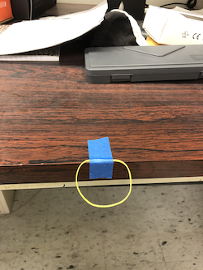
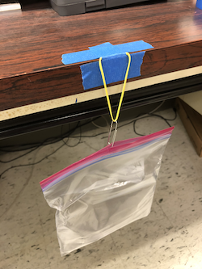
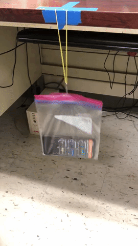

# Lab 3: Simple Harmonic Motion, Week 2
---
### All Materials Needed:
- A rubber band
- One or two zip-lock bags
- Paper clip
- Household baking goods and measuring cups, coins, batteries, or other objects of known mass.
- Tape
- Measuring tape or meter stick
- Pillow, couch cushion, or something similar.
- Somewhere to hang your spring, e.g., shower curtain rod, broomstick across two chairs, large table, etc. 
- Phyphox &ldquo;Acceleration (without g)&rdquo; preferred, or &ldquo;Acceleration (with g).&rdquo;

### Optional Materials

- Zip ties
- Scissors

### Lab Goals:
- ** Construct an apparatus **
	- Find a rubber band, and all necessary mounting pieces.
	- Find a surface and location to hang your masses, such as a table, shower rod, broom, etc.
	- Find masses to use in your experiment.
- ** Data Analysis **
	- Understand the theory behind Hooke's Law.
	- Write the equations that will be used to process the data.
	- Prepare a spreadsheet for data analysis.

---

## Building Your Lab

In this lab you will be mounting a rubber band to a horizontal surface for two exercises. The first exercise will require you to attach a variety of masses to your rubber band, and the second will require you to attach your phone to your rubber band. Figure 3 shows a possible setup. Note that the setup for both exercises will be similar.

:::Exercise 
In this experiment you will be using some masses and your phone to measure characteristics of simple harmonic motion. You will build an apparatus and take data for analysis. Be sure to include a picture of your setup if you can!

The process of building your experiment will be similar to the procedure you used to make apparatus for your previous lab, &Ldquo;Pendulum.&rdquo; There is a variety of ways in which you could build this apparatus. Please read through all of the instructions before considering alternate steps.

1. Collect all of the materials you will need for this setup: rubber band, tape, paper clips, zip-lock bags, makeshift weights (sugar, flour, salt, cornstarch, coins). Optional items include scissors and zip ties.

2. Find the location where you will build your apparatus. You should be fine with building this wherever you built your pendulum from the previous lab.

:::Figure:Figure

:::

In this lab you will have your phone oscillating on a rubber band, so you will want to make sure your phone is not suspended too high, and that you can place a cushion underneath it.

3. Secure the top of your rubber band to your mounting point using tape. If you are mounting to a broom or cylindrical object, you can zip tie the broom and rubber band together.

:::Figure:Figure
:::row
:::column

:::
:::column

:::
:::column

:::
:::
:::

4. Now take your zip-lock bag and attach your paper clip to it. It is best if you can secure the bag by using only one side, so that you can have easier access to the inside of the bag.

:::Figure:Figure
:::row
:::column

:::
:::column

:::
:::
:::

5.  Hook your rubber band to your paper clip. 

Once you have your setup, it should look something like this:

:::Figure:Figure

:::

You may consider alternate mounting methods if you have a solution that is better for your space.

Note: You will want to place a cushion under your apparatus in case the rubber band breaks, or your masses or phone slip.

:::

### The First Experiment

:::Figure:Figure

:::

A better way to determine the spring constant would be to vary the mass and measure the stretch for each mass. From many data points we could create a plot and perform a fit.

For this lab you will hang a zip-lock bag on a rubber band, and add mass to the bag. You will measure the length of the rubber band as you add more and more mass.

## The Second Experiment

:::Figure:Figure

:::

The second experiment for next week will involve your putting your phone in the zip-lock bag and then setting it in motion. You will use the &ldquo;Acceleration without g&rdquo; to measure the acceleration experienced by your phone. You will then use the acceleration to measure the period, and the spring constant of the rubber band.

As we do for a pendulum, we typically talk about the period of the position and not the acceleration. You will be measuring acceleration. Since we know that the mass on a spring is also a simple harmonic oscillator, we know that the position as a function of time looks like the following:

:::Figure:Equation
$$
y = A\sin(\Omega t)
$$
:::

where $A$ is the amplitude or the initial displacement, and $\Omega$ is the angular frequency.

## Mass Tables

US Coins:

| Dollar | Half Dollar | Quarter | Dime | Nickel | Penny |
| :--------: | :--------: | :--------: | :--------: | :--------: | :--------: |
| 8.1g | 11.3g | 5.7g | 2.3g | 5.0g | 2.5g |

Batteries:

| | AA | AAA | 9-V | D | C |
| -------- | :--------: | :--------: | :--------: | :--------: | :--------: | 
| Alkaline | 23g | 11.5g |45g | 135g | 65g | 
| Lithium | 15g | 7.6g | 37g| -|- | 
|Rechargable Ni-MH | 31g | 14g |-  | 160g | 80g |

Household goods: 

|  | Metric equivalent (ml) | Water | All Purpose Flour | Granulated White Sugar | Table Salt |
| -------- | :--------: | :--------: | :--------: | :--------: | :--------: |
| Density (g/ml) |   | 1g/ml |  0.6g/ml |  0.92g/ml    |  1.26g/ml  | 
| 1 cup     |  237ml    |   237g   |  130g   | 200g | 273g | 
| 1 teaspoon     |  4.9ml    |   4.9g   |   3.3g  | 4g | 5.7g |
| 1 tablespoon     |  14.8ml    |   14.8g   |   8.5g  | 12.6g | 17g |

## Hooke's Law
:::Exercise
In this exercise you will be adding masses and collecting data on the length change of your rubber band. 

:::Note
Do not leave masses on your elastic for too long as this with deform and stretch the rubber band.
:::
1. Collect the masses you decided on last week. If you have changed your masses that is fine, just be sure to update your data table.
2. Take 10 data points starting with 20g going to roughly 500g. The maximum mass can vary depending on what your rubber band can handle, make sure to get at least 10 data points.
3. Record your mass and $\Delta$y data in the spreadsheet you made last week. 
4. Check your units and ensure they are correct. Calculate the values in your table for F and k. 

:::Quustion
a)What tool did you use to make your length measurements?

b) What is your uncertainty?
:::

:::Question
a) Describe the masses you used.

b) Estimate your uncertainty in your mass values.

c) What are the sources of uncertainty here? / How did you determine your uncertainty?
:::

:::

:::Exercise
In this exercise you will be analyzing the data from Exercise 2 to determine if a rubber band obeys Hooke's Law.

1. Graph $\Delta$y vs m, with m as the independent variable. 

:::Question
a) What is the expression for your slope of the graph you made above?

b) What value of k do you get from your graph?

c) How does the slope change as a function of length stretched?

d) How does your k value from your graph and k values from your table compare?
:::

2. Now put your phone (or whatever device you will be using with PhyPhox for experiment 2), in your bag and measure the displacement $\Delta$y. If your bag is dirty due to the masses used, go ahead and use a new bag.

:::Question
a) What is the displacement $\Delta$y with your phone as your mass?

b) Using your data from experiment 1 and your $\Delta$y for your phone, estimate the weight of your phone.

c) How does this value compare to what you find online? Note that cases and other things on your phone will increase your estimated weight. 
:::

:::

## Simple Harmonic Motion

Transition/recap from last week's description. Maybe a prep question or two

:::Exercise
In experiment 2 you will use your apparatus from experiment 1 to explore simple harmonic motion. You will use a PhyPhox enabled device to measure the period of the simple harmonic motion of your rubber band. 

1. Download and open the PhyPhox app on your mobile device. 
2. Open the "Acceleration (without g)" module on PhyPhox. If you only have "Acceleration with g" that is fine too.
3. Test your accelerometer axes. To do this begin recording data by pressing the play button in the module. Move your phone in each axis and take note of which accelerometer (x, y, or z) picks up data for each movement. Take note of this 
AVOCADO- Should I have them start at different amplitudes? I assume no
4. Place your phone in the bag attached to your elastic. Note which accelerometer will be collecting vertical motion with your phone in this position.
5. AVOCADO - So we want this or just the absolute graph. I feel its important to at least see how this works.
6. The Absolute tab will have a graph that combines the data from each acceleromter to give an absolute acceleration graph.
7. Press the play button in the module to begin recording data.
8. Pull down your phone to stretch the rubber band and let go.
9. Once your device stops oscillating pull out your phone and stop recording data. 
10. Look at your data by pressing on the graph (AVOCADO for the accelerometer in the correct orientation).
11. You can use two fingers to pan and zoom so that you see only the relevant data.

Figure 11 shows your raw PhyPhox data. From left to right, the Acceleration module page, the full raw data for acceleration in the x direction, zoomed in data for acceleration in the x direction. 

:::Figure:Figure
:::row
:::column

:::
:::column

:::
:::column

:::
:::
:::

12. Press on the "Pick data" icon on the bottom of the page and tap on the graph to select a point.
13. You can take data from each minimum or maximum as shown in figure 12. 

:::Figure:Figure
:::row
:::column

:::
:::column

:::
:::
:::

14. Find $\Delta$t for as many clear periods you have and not how many periods that is.
15. Fill your data table with your measured $\Delta$t and the number of periods.
16. Repeat this process with two added masses.

You can add masses in a separate bag as shown below if you are using something like water or flour.

:::Figure:Figure
:::row
:::column

:::
:::column

:::
:::
:::

AVOCADO - How do they get their data off of PhyPhox, I only know how to do it manually. Do we have a guide for this or should I write one?

17. Export your graph? This would be best probably

AVOCADO - Do we want them to do multiple masses, instead of only 2 or 3? This way they can make a T vs mass plot (and T^2 vs m). 

:::Question

:::

:::Question
Whaaaaaaaaaat???
:::

:::

With your data collected we can now dive more into theory and use your findings to supplement your understanding.

In week 1 we explored the theory of simple harmonic motion and expressed the periodic motion as described by this equation:

:::Figure:Equation
$$
y = A sin(\Omega t)
$$
:::

where $\Omega$ is the angular frequency. Angular frequency means the frequency at which 2$\pi$ has been traveled, or one cycle.

How do we have them derive $\Omega$? AVOCADO

:::Question
a) Derive the period of simple harmonic motion both in terms of $\Omega$ and in terms of k and m.

b) For a given mass, how would the stiffness of a spring affect its frequency and period?

c) Why do you think that mass increases period? Hint: Think about this in terms of F=ma.
:::

## Conclusion

::: Exercise
1. Give a short summary of Hooke&rsquo;s Law. 
2. Give a quick summary of the important parts of this lab.
:::
