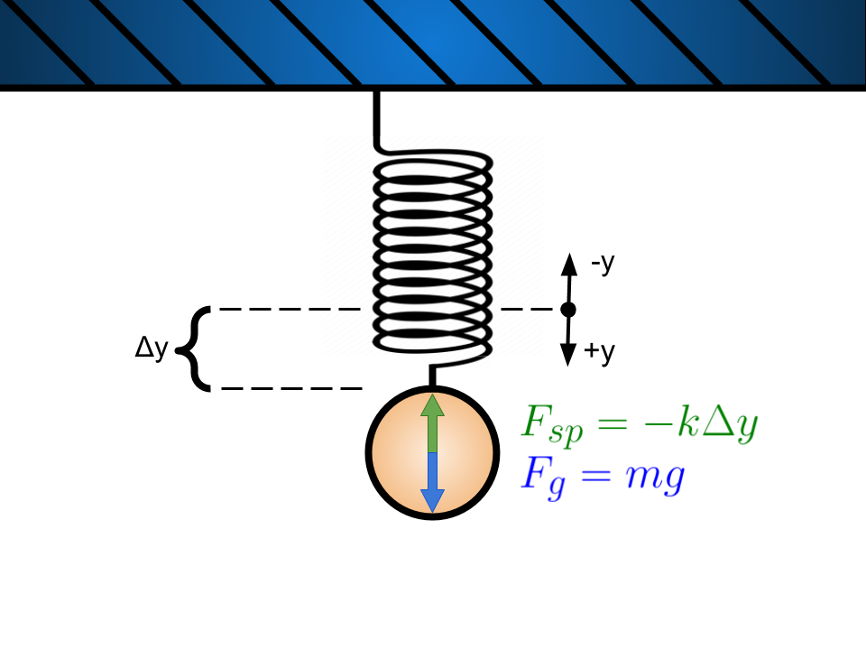

# Lab 3: Simple Harmonic Motion Week 1
---
### All Materials Needed:
- A rubber band
- One or two Ziplock bags
- Paperclip
- Household baking goods and measuring cups, coins, batteries, or other objects of known masses.
- Tape
- Measuring tape or meter stick
- Pillow, couch cushion, or something similar.
- Somewhere to hang your spring, e.g., shower curtain rod, broomstick across two chairs, large table, etc. 
- Phyphox "Acceleration (without g)" preferred, or "Acceleration (with g)".

### Optional Materials

-Zip ties

-Scissors

### Lab Goals:
- ** Construct an apparatus **
	- Find a rubber band, and all necessary mounting pieces.
	- Find a surface and location to hang your masses from; such as a table, shower rod, broom, etc.
	- Find masses to be used in your experiment.
- ** Data Analysis **
	- Understand the theory behind Hooke's Law.
	- Generate the equations that will be used to process the data.
	- Prepare spreadsheet for data analysis.

---

# Part I: Hooke's Law

Most springs obey Hooke's Law: the magnitude of the force  the spring exerts is proportional to the amount it is stretched. This is mathematically expressed as: 

:::Figure:Equation
$$
F_{sp} = -k y
$$
:::

Where $F_{sp}$ is the force exerted by the spring, $y$ is the displacement from the springs equilibrium position, and $k$ is the spring constant. The larger the spring constant $k$, the "stiffer" the spring.  As a matter of fact, the constant $k$ is often referred to as the stiffness.

For the purpose of the lab we will define the origin, the zero point, as spot at the end of the spring when it is hanging in its relaxed state. See Figure 1 below.

:::Figure:Figure

:::

Hooke's law is an excellent description for spring buy often times applies to more than just springs. It is also sometimes accurate when dealing with elastic materials such as rubber bands. 

If we were to hang a mass, $m$, from a rubber band and wait for the system to come to equilibrium (stop moving) we could determine the spring force by using Newton's second law and the force of gravity. 

:::Figure:Figure

:::

We will define the downward direction as positive. See Figure 2 for a free body diagram. Putting this together we have:

:::Figure:Equation
$$
\sum F = F_{sp}+F_g = F_{sp}+mg =0 \\
\implies F_{sp}=-mg
$$
:::

Where in the first line of the equation we recognized that for a system in equilibrium the acceleration is zero.

Thus we can use the mass and gravity to measure the spring force. From this we can measure the spring constant of the rubber band.

:::Question
Use Equation 1 and Equation 2 to write the equation for the spring constant.
:::

### The First Experiment

:::Figure:Figure

:::

A better way to determine the spring constant would be to very the mass and measure the length. From many data point we could create a plot and perform a fit.

For this lab you will hang a Ziploc bag on a rubber band then add mass to the bag. You will measure the length of the rubber band as you add more and more mass.

:::Question
a) Rewrite your answer to Question 1 to have postion, $y$, as a function of mass $m$.

b) If you were to create the plot of length vs mass, what is the expression for the slope?

c) How does the slope change with stiffness of the spring or rubber band?
:::

# Part II: Springs in Motion (More Harmonic Motion)

Another way to determine the spring constant is to hang a single mass from the spring. If you were to displace the mass from its equilibrium position slightly and release you would see the mass oscillate around the equilibrium position. This should sound **very** familiar.

In fact, this is another form of a simple harmonic oscillator. 

In order show this mathematically we must first determine the net force on the mass when it is slightly displaced. 

:::Figure:Figure

:::

Figure 4 shows the mass in three different positions labeled 1, 2, and 3. Position 1 shows the unstretched spring which is what we use to mark the zero position. Position 2 is the mass in its equilibrium position. Position 3 shows the mass when it has been displaced by an amount $\Delta y$ from equilibrium. 

We already know that in position 2 the spring force is given by:

:::Figure:Equation
$$
F_{sp2} = ky_0 = mg
$$
:::

Then, if you look at the net force on the mass in position three you would see :

:::Figure:Equation
$$
\sum F = -ky_1+mg \\

= -ky_1 + ky_0 = -k\Delta y
$$
:::

In the above we used the fact that $\Delta y = y_1 - y_0$ in the final step.

:::Question
Use Newton's second law and Equation 4 to determine acceleration felt by the mass, $a_y$. 
:::

:::Question
Is the oscillating mass a simple harmonic oscillator? Use your response to question 3 to help justify your answer. **Hint:** Look back ad Lab 2 Week 1 if you need help.
:::

:::Question
a) What is the expression for the angular frequency, $\Omega$, of this simple harmonic oscillator?

b) What is the period of oscillation?
:::

::: Question
a) For a given mass, a stiffer spring causes greater of lesser frequency? Period?

b) Why do you think that mass increases the period? Hint: Thing about this in terms of $F=ma$
:::

## The Second Experiment

The second experiment for next week will involve you putting your phone in the Ziploc bag and then setting it in motion. You will use the "Acceleration without g" to measure the acceleration experienced by your phone. You will then use the acceleration to measure the period and the spring constant and the rubber band.

## Building Your Lab

In this lab you will be mounting a rubber band to a horizontal surface for two exercises. The first exercise will require you to attach a variety of masses to your rubber band, and the second will require you to attach your phone to your rubber band. Figure 3 shows a possible set up. Note, the set up for both exercises will be similar.

:::Exercise 
In this experiment you will be using some masses and your phone to measure characteristics of simple harmonic motion. You will build an apparatus and take data for analysis. Be sure to include a picture of your set up if you can!

The process of building your experiment will be similar to the apparatus you made in your previous lab, Pendulum. You can also build this with many different variations. Please read through all of the instructions before considering alternate steps.

1. Collect all of the materials you will need for this set up: rubber band, tape, paper clips, zip-lock bags, makeshift weights (sugar, flour, salt, cornstarch, coins). Optional items include scissors and zip ties.

2. Find the location where you will build your apparatus. You should be fine with building this wherever you build your pendulum from the previous lab.

:::Figure:Figure

:::

In this lab you will have your phone oscillating on a rubber band, so you will want to make sure your phone is not suspended to high, and that you can place a cushion underneath it.

3. Secure the top of your rubber band to your mounting point using tape. If you are mounting to a broom or cylindrical object, you can zip tie the broom and rubber band together.

:::Figure:Figure
:::row
:::column

:::
:::column

:::
:::column

:::
:::
:::

4. Now take your zip-lock bag and attach your paper clip to it. It is best if you can secure the bag only using one side so that you can better access the inside of the bag.

:::Figure:Figure
:::row
:::column

:::
:::column

:::
:::
:::

5.  Hook your rubber band to your paperclip. 

Once you have your set up it should look something like this:

:::Figure:Figure

:::

You may consider alternate mounting methods if you have a solution that is better for your space.

Note: You will want to place a cushion under your apparatus in case the rubber band breaks or you masses or phone slip.

:::

## Making your Spreadsheets

With your apparatus built we will want to prepare the masses and your data tables.
You will be collecting data in two experiments, one with only masses, and one with your phone and other masses.

:::Exercise
Making your data tables now will help organization and reduce workload for next week. 

Make a table in Google sheets as seen below for the first experiment.

| Length (m) | $\Delta$y (m) | Mass (kg) | Mass Description | Force (N)| k | 
| -------- | -------- | -------- | -------- | -------- | -------- |
|   -   |  -  |     - |  -|   -   |  -  |     - |
|   -   |  -  |     - |   -   |  -  |     - |

Your independent 

Make another table in Google Sheets as seen below for the second experiment.

| Mass | time$_i$ | time$_f$ | $\Delta t$ | number of periods (n) | T  (s) | k | 
| -------- | -------- | -------- | -------- | -------- | -------- | -------- |
|   -   |  -  |     - |   -   |  -  |     - | - |

:::

## Figuring out your Masses

:::Exercise

At this point your apparatus should look like Figure 8 above.

Now we need to figure out what masses you can use with your apparatus.

You can use any household item you can weigh for this, however, we have several recommendations: Coins, Batteries, Water, Flour, Sugar, and Salt.

The mass range you will want to be looking at is anywhere from about 20g to 1000g depending on how thick your rubber band is. Most small rubber bands should only get about 350g, while thicker ones can hold over 1000g.

Mixing and matching materials for your masses is certainly fine. Please note however, that certain items should not be combined, such as water and batteries. Below are tables for how much each of your recommended materials weigh.

Figure 9 is an example of what your experiment will look like when using household goods.

:::Figure:Figure
:::row
:::column

:::
:::column

:::
:::
:::

US Coins:

| Dollar | Half Dollar | Quarter | Dime | Nickle | Penny |
| -------- | -------- | -------- | -------- | -------- | -------- |
| 8.1g | 11.3g | 5.7g | 2.3g | 5.0g | 2.5g |

Batteries:

| | AA | AAA | 9V | D | C |
| -------- | -------- | -------- | -------- | -------- | -------- | 
| Alkaline | 23g | 11.5g |45g | 135g | 65g | 
| Lithium | 15g | 7.6g | 37g| -|- | 
|Rechargable Ni-MH | 31g | 14g |-  | 160g | 80g |

Household goods: 

|  | Metric (ml) | Water | All Purpose Flour | Granulated White Sugar | Table Salt |
| -------- | -------- | -------- | -------- | -------- | -------- |
| Density (g/ml) |   | 1g/ml |  0.6g/ml |  0.92g/ml    |  1.26g/ml  | 
| 1 cup     |  237ml    |   237g   |  130g   | 200g | 273g | 
| 1 teaspoon     |  4.9ml    |   4.9g   |   3.3g  | 4g | 5.7g |
| 1 tablespoon     |  14.8ml    |   14.8g   |   8.5g  | 12.6g | 17g |

1. Find your available materials and roughly think about how you can distribute your masses to have 10 - 15 different mass values between 20g and 500g. Measure out your available materials and make a mass plan for each mass value you want to test. Mass values of roughly 20g, 50g, 100g, 150g, 200g, 250g, 300g, 350g, 400g, 450g, 500g would be great.
2. Write out your chosen masses and what breakdown of what materials are used for them in the table you made for experiment 1.

Note that 20g is a good starting point so that your rubber band starts out taught. 

Because your zip-lock is mounted via a paper clip, you can easily replace your bag when moving onto experiment 2. This will be useful if you are using messy masses such as flour or water.

Note: If you are using messy household goods, you can use two bags for experiment 2. Put your masses into a separate bag, then place that bag with your phone in the main bag as seen in Figure 10. 

:::Figure:Figure
:::row
:::column

:::
:::column

:::
:::
:::

:::

Rebuild apparatus

## Hooke's Law
:::Exercise
In Experiment 1 you will be verifying and analyzing Hooke's Law.

In week 1 you built your prototype apparatus and looked at the theory behind Hooke's Law.

This week you will test the theory and analyze your results. Note: Do not leave masses on your elastic for too long as this with deform and stretch the rubber band.

1. Collect the masses you decided on last week. If you have changed your masses that is fine, just be sure to update your data table.
2. Starting with your minimum mass, roughly 20g, add masses in the roughly 50g increments you determined last week. As a reminder, these increments should be roughly: 20g, 50g, 100g, 150g, 200g, 250g, 300g, 350g, 400g, 450g, 500g. You may do additional mass if you feel the rubber band can handle the extra weight. 
3. Record your mass and $\Delta$y data in your table. 
4. Make sure to remove your masses when not recording data, this will prevent your rubber band from deforming.
5. Check your units and ensure they are correct and calculate the rest of the values in your table. 
6. Graph $\Delta$y vs m, with m as the independent variable. 

:::Question
a) What is the expression for your slope of the graph you made above?

b) What value of k do you get from your graph?

c) How does the slope change as a function of length stretched?

d) How does your k value from your graph and k values from your table compare?
:::

7. Now put your phone (or whatever device you will be using with PhyPhox for experiment 2), in your bag and measure the displacement $\Delta$y. If your bag is dirty due to the masses used, go ahead and use a new bag.

:::Question
a) What is the displacement $\Delta$y with your phone as your mass?

b) Using your data from experiment 1 and your $\Delta$y for your phone, estimate the weight of your phone.

c) How does this value compare to what you find online? Note that cases and other things on your phone will increase your estimated weight. 
:::

:::

## Simple Harmonic Motion

Transition/recap from last week's description. Maybe a prep question or two

:::Exercise
In experiment 2 you will use your apparatus from experiment 1 to explore simple harmonic motion. You will use a PhyPhox enabled device to measure the period of the simple harmonic motion of your rubber band. 

1. Download and open the PhyPhox app on your mobile device. 
2. Open the "Acceleration (without g)" module on PhyPhox. If you only have "Acceleration with g" that is fine too.
3. Test your accelerometer axes. To do this begin recording data by pressing the play button in the module. Move your phone in each axis and take note of which accelerometer (x, y, or z) picks up data for each movement. Take note of this 
AVOCADO- Should I have them start at different amplitudes? I assume no
4. Place your phone in the bag attached to your elastic. Note which accelerometer will be collecting vertical motion with your phone in this position.
5. AVOCADO - So we want this or just the absolute graph. I feel its important to at least see how this works.
6. The Absolute tab will have a graph that combines the data from each acceleromter to give an absolute acceleration graph.
7. Press the play button in the module to begin recording data.
8. Pull down your phone to stretch the rubber band and let go.
9. Once your device stops oscillating pull out your phone and stop recording data. 
10. Look at your data by pressing on the graph (AVOCADO for the accelerometer in the correct orientation).
11. You can use two fingers to pan and zoom so that you see only the relevant data.

Figure 11 shows your raw PhyPhox data. From left to right, the Acceleration module page, the full raw data for acceleration in the x direction, zoomed in data for acceleration in the x direction. 

:::Figure:Figure
:::row
:::column

:::
:::column

:::
:::column

:::
:::
:::

12. Press on the "Pick data" icon on the bottom of the page and tap on the graph to select a point.
13. You can take data from each minimum or maximum as shown in figure 12. 

:::Figure:Figure
:::row
:::column

:::
:::column

:::
:::
:::

14. Find $\Delta$t for as many clear periods you have and not how many periods that is.
15. Fill your data table with your measured $\Delta$t and the number of periods.
16. Repeat this process with two added masses.

You can add masses in a separate bag as shown below if you are using something like water or flour.

:::Figure:Figure
:::row
:::column

:::
:::column

:::
:::
:::

AVOCADO - How do they get their data off of PhyPhox, I only know how to do it manually. Do we have a guide for this or should I write one?

17. Export your graph? This would be best probably

:::Question

:::

:::Question
Whaaaaaaaaaat???
:::

:::

With your data collected we can now dive more into theory and use your findings to supplement your understanding.

In week 1 we explored the theory of simple harmonic motion and expressed the periodic motion as described by this equation:

:::Figure:Equation
$$
y = A sin(\Omega t)
$$
:::

where $\Omega$ is the angular frequency. Angular frequency means the frequency at which 2$\pi$ has been traveled, or one cycle.

How do we have them derive $\Omega$? AVOCADO

:::Question
a) Derive the period of simple harmonic motion both in terms of $\Omega$ and in terms of k and m.

b) For a given mass, how would the stiffness of a spring affect its frequency and period?

c) Why do you think that mass increases period? Hint: Think about this in terms of F=ma.
:::

## Conclusion

::: Exercise
1. Give a short summary of Hooke's Law. 
3. Give a quick summary of the import parts of this lab.
:::
