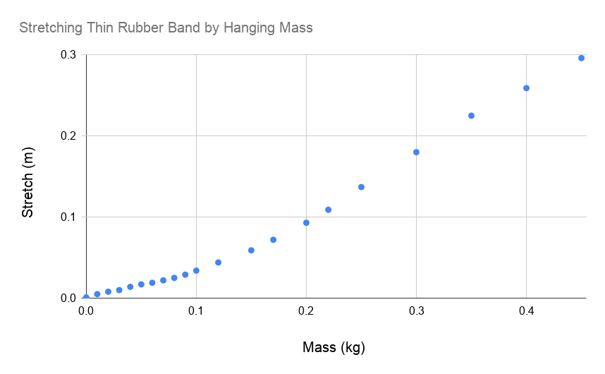
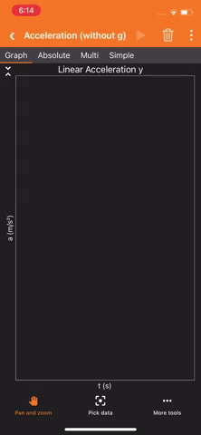
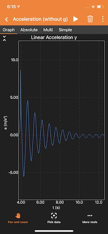

# Lab 3: Simple Harmonic Motion, Week 2
---
### All Materials Needed:
- A rubber band
- One or two zip-lock bags
- Paper clip
- Household baking goods and measuring cups, coins, batteries, or other objects of known mass.
- Tape
- Measuring tape or meter stick
- Pillow, couch cushion, or something similar.
- Somewhere to hang your spring, e.g., shower curtain rod, broomstick across two chairs, large table, etc. 
- Phyphox &ldquo;Acceleration (without g)&rdquo; preferred, or &ldquo;Acceleration (with g).&rdquo;

### Optional Materials

- Zip ties
- Scissors

### Lab Goals:
- ** Construct an apparatus **
	- Find a rubber band, and all necessary mounting pieces.
	- Find a surface and location to hang your masses, such as a table, shower rod, broom, etc.
	- Find masses to use in your experiment.
- ** Data Analysis **
	- Understand the theory behind Hooke's Law.
	- Write the equations that will be used to process the data.
	- Prepare a spreadsheet for data analysis.

---

## Part I: Building Your Lab

In this lab you will be mounting a rubber band to a horizontal surface for two exercises. The first exercise will require you to attach a variety of masses to your rubber band, and the second will require you to attach your phone to your rubber band. Figure 3 shows a possible setup. Note that the setup for both exercises will be similar.

:::Exercise 
In this experiment you will be using some masses and your phone to measure characteristics of simple harmonic motion. You will build an apparatus and take data for analysis. Be sure to include a picture of your setup if you can!

The process of building your experiment will be similar to the procedure you used to make apparatus for your previous lab, &Ldquo;Pendulum.&rdquo; There is a variety of ways in which you could build this apparatus. Please read through all of the instructions before considering alternate steps.

1. Collect all of the materials you will need for this setup: rubber band, tape, paper clips, zip-lock bags, makeshift weights (sugar, flour, salt, cornstarch, coins). Optional items include scissors and zip ties.

2. Find the location where you will build your apparatus. You should be fine with building this wherever you built your pendulum from the previous lab.

:::Figure:Figure

:::

In this lab you will have your phone oscillating on a rubber band, so you will want to make sure your phone is not suspended too high, and that you can place a cushion underneath it.

3. Secure the top of your rubber band to your mounting point using tape. If you are mounting to a broom or cylindrical object, you can zip tie the broom and rubber band together.

:::Figure:Figure
:::row
:::column

:::
:::column

:::
:::column

:::
:::
:::

4. Now take your zip-lock bag and attach your paper clip to it. It is best if you can secure the bag by using only one side, so that you can have easier access to the inside of the bag.

:::Figure:Figure
:::row
:::column

:::
:::column

:::
:::
:::

5.  Hook your rubber band to your paper clip. 

Once you have your setup, it should look something like this:

:::Figure:Figure

:::

You may consider alternate mounting methods if you have a solution that is better for your space.

Note: You will want to place a cushion under your apparatus in case the rubber band breaks, or your masses or phone slip.

:::

### Mass Tables

US Coins:

| Dollar | Half Dollar | Quarter | Dime | Nickel | Penny |
| :--------: | :--------: | :--------: | :--------: | :--------: | :--------: |
| 8.1g | 11.3g | 5.7g | 2.3g | 5.0g | 2.5g |

Batteries:

| | AA | AAA | 9-V | D | C |
| -------- | :--------: | :--------: | :--------: | :--------: | :--------: | 
| Alkaline | 23g | 11.5g |45g | 135g | 65g | 
| Lithium | 15g | 7.6g | 37g| -|- | 
|Rechargable Ni-MH | 31g | 14g |-  | 160g | 80g |

Household goods: 

|  | Metric equivalent (ml) | Water | All Purpose Flour | Granulated White Sugar | Table Salt |
| -------- | :--------: | :--------: | :--------: | :--------: | :--------: |
| Density (g/ml) |   | 1g/ml |  0.6g/ml |  0.92g/ml    |  1.26g/ml  | 
| 1 cup     |  237ml    |   237g   |  130g   | 200g | 273g | 
| 1 teaspoon     |  4.9ml    |   4.9g   |   3.3g  | 4g | 5.7g |
| 1 tablespoon     |  14.8ml    |   14.8g   |   8.5g  | 12.6g | 17g |

## Part II: Hooke's Law

### The First Experiment

:::Figure:Figure

:::

A better way to determine the spring constant would be to vary the mass and measure the stretch for each mass. From many data points we could create a plot and perform a fit.

For this lab you will hang a zip-lock bag on a rubber band, and add mass to the bag. You will measure the length of the rubber band as you add more and more mass.

### Hooke's Law
:::Exercise
In this exercise you will be adding masses and collecting data on the length change of your rubber band. 

:::Note
Do not leave masses on your elastic for too long as this with deform and stretch the rubber band.
:::
1. Collect the masses you decided on last week. If you have changed your masses that is fine, just be sure to update your data table.
2. Take 10 data points starting with 20g going to roughly 500g. The maximum mass can vary depending on what your rubber band can handle, make sure to get at least 10 data points.
3. Record your mass and $\Delta$y data in the spreadsheet you made last week. 
4. Check your units and ensure they are correct. Calculate the values in your table for F and k. 

:::Question
a) What tool did you use to make your length measurements?

b) What is your uncertainty?
:::

:::Question
a) Describe the masses you used.

b) Estimate your uncertainty in your mass values.

c) What are the sources of uncertainty here?
:::

:::

:::Exercise
In this exercise you will be analyzing the data from Exercise 2 to determine if a rubber band obeys Hooke's Law.

1. Graph $\Delta$y vs m, with m as the independent variable. 

:::Question
a) Based on the equation you derived in last week's lab, what should the functional form of this plot be? i.e. (quadratic, root, linear, exponential, etc.)

b) What is the shape of your graph, does it look linear?
:::

You may find that your data is not explicitly linear but has linear like regions. Below in Figure 6 you see on the left a plot of some data that we collected. You'll notice it is not linear, but if we focus only on the regions for small masses or on the regions for large masses it behaves pretty linearly. This is shown with the example purple and green best fit lines. 

:::Figure:Figure
:::row
:::column

:::
:::column

:::

:::
:::

:::Question

c) If it does not look linear, are there portions which are linear? What regimes are linear?

d) What is the value of k in your linear regime or regimes? 

e) How does your k value from your graph and k values from your table compare? Is there a region from your data table where k matches your linear regime k from your graph?
:::

2. Graph k as a function of $\Delta$y 

:::Question
a) What is the shape of this slope?

b) Is there a portion that is constant?

c) How does the region where k is constant compare to the linear regime above?

b) How does the slope change as a function of length stretched?
:::

:::

:::Exercise
In this exercise you will use the data you collected an analyzed in Exercises 2 and 3 to measure the mass of your phone. 

1. Place your PhyPhox enabled device you plan on using in experiment 2 in your bag such that it is the only mass weighing on your rubber band.  Measure the displacement $\Delta$y. If your bag is dirty due to the masses used, go ahead and use a new bag.

:::Question
a) What is the displacement $\Delta$y with your phone as your mass?

b) Using your data from experiment 1 and your $\Delta$y for your phone, estimate the weight of your phone.

c) How does this value compare to what you find online? Note that cases and other things on your phone will increase your estimated weight. 
:::

:::

## Part III: Simple Harmonic Motion

### The Second Experiment

:::Figure:Figure

:::

The second experiment for next week will involve your putting your phone in the zip-lock bag and then setting it in motion. You will use the &ldquo;Acceleration without g&rdquo; to measure the acceleration experienced by your phone. You will then use the acceleration to measure the period, and the spring constant of the rubber band.

As we do for a pendulum, we typically talk about the period of the position and not the acceleration. You will be measuring acceleration. Since we know that the mass on a spring is also a simple harmonic oscillator, we know that the position as a function of time looks like the following:

:::Figure:Equation
$$
y = A\sin(\Omega t)
$$
:::

where $A$ is the amplitude or the initial displacement, and $\Omega$ is the angular frequency.

### Simple Harmonic Motion

:::Exercise
In experiment 2 you will use your apparatus from experiment 1 to explore simple harmonic motion. You will use a PhyPhox enabled device to measure the period of the simple harmonic motion of your rubber band. 

1. Download and open the PhyPhox app on your mobile device. 
2. Open the "Acceleration (without g)" module on PhyPhox. If you only have "Acceleration with g" that is fine too.
3. Place your phone in the bag attached to your elastic. Note which accelerometer will be collecting vertical motion with your phone in this position.
4. Press the play button in the module to begin recording data.

:::Note
You should **not** use the time delay function used in Pendulum.
:::

5. Pull down your phone to stretch the rubber band and let go.
6. Once your device stops oscillating pull out your phone and stop recording data. 

:::Note
You should expect to see significant damping in this data. Figure Guac shows some sample data
:::

Figure GUAC shows how you will be collecting your data. Notice the regions of junk data and real data.

:::Figure:Figure
:::row
:::column

:::
:::column

:::
:::column

:::
:::
:::

7. Find $\Delta$t for as many clear periods you have and not how many periods that is.
8. Fill your data table with your measured $\Delta$t and the number of periods, n.

Figure GUAC shows how you will be collecting your data.
:::Figure:Figure

:::

:::Note
To calculate the period T, divide your time by n is the number of periods, not peaks. 
:::

9. Pick four mass values between roughly 50g and 200g to add to your phone for more data.
10. Repeat this process with four additional mass values. Try to pull the rubber band down a similar length each run. 

:::Note
You can add masses in a separate bag as shown below if you are using something messy such as water or flour.
:::

:::Figure:Figure
:::row
:::column

:::
:::column

:::
:::
:::

:::

:::Exercise
In this exercise you will analyze your data to do cool things.

With your data we now math and science!

1. Derive the expression for period, T, as a function of mass, m, and k. 
2. Graph your data for T as a function of m for your 6 runs from experiment 2.

:::Question
a) Describe the slope of your graph.

b) How would you linearize your data?
:::

3. Derive the linearized expression for period with respect to m.
4. Graph your linearized equation.
5. Fit a line to your linearized graph.

:::Question
a) What is the expression for the slope of your line?

b) What is the k value from your fit data?

c) How does this k value compare to the value you got in experiment 1?
:::

:::Question
a) Does your rubber band you used obey Hooke's Law?

b) In what regime or regimes does it obey Hooke's Law?
:::
:::

AVOCADO We should maybe have a discussion about HOW and WHY Hooke's law breaks down. Maybe thats too complicated, but I think it would be a good final question to have them think about that.

## Conclusion

::: Exercise
1. Give a short summary of Hooke&rsquo;s Law. 
2. Give a quick summary of the important parts of this lab.
:::
