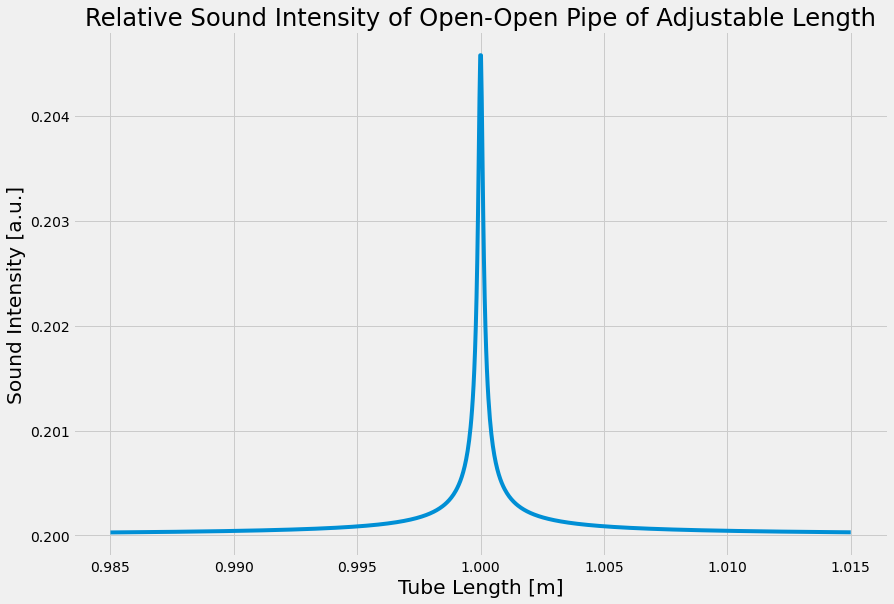

# Lab 4: Speed of Sound - Week 1
---
### All Materials Needed:
- One empty paper towel role, ~28 cm long. 
- A second, same sized, paper towel role, (may or may not have paper towels attached)
- Scissors
- Tape
- Measuring tape, meter stick, or ruler

### Optional Materials

- Laptop
- Headphones

### Lab Goals:
- ** Construct an apparatus **
	- Create a variable length tube
- ** Data Analysis **
	- Understand the theory behind resonance
	- Determine resonance length
	- Determine frequency to be used for experiment
---

# Part I: Sound, Waves, & Resonance

### Sound

Sound is caused by a disturbance in the surrounding medium—air. Air is an elastic medium, meaning it returns to its original shape once forces stop acting on it. Consider a single audio speaker. When music is playing the speaker vibrates, pushing and pulling air molecules surrounding it. 

:::Figure:Figure

:::

When the speaker moves outward, it pushes out surrounding air molecules and that push causes a chain reaction of disturbances that propagate through the air. When the speaker moves inward, it creates more space for air particles to move, starting with the air molecules closest to the speaker. This is known as positive and negative displacement.

:::Figure:Figure

:::

Figure 2 shows a speaker at the left vibrating at some frequency. You can see compression waves traveling to the right. Notice though that any one particle (some have been highlighted in red) doesn't actually move to the right but just oscillates back and forth.

### Speed of Sound

The speed of sound results from the inertia and elastic properties of the material it travels through. The greater the mass of individual particles of the medium, the less responsive they will be to the interactions between neighboring particles and the slower the wave. A sound wave will travel faster in a less dense material than a more dense material. For instance, a sound wave will travel nearly three times faster in Helium as it will in air. A sound wave will travel faster in a medium with more restoring force. Sound (technically acoustic) waves travel extremely fast in metals which have stiff crystal structures to restore individual particles.

Sound waves propagate at velocity $v_s$. The speed of propagation is determined by the medium through which the wave propagates.

The speed of sound in air can be expressed by the following equation:

:::Figure:Equation
$$
v_s = 331+ 0.6  T
$$
:::

where T is the temperature of the air in degrees Celsius.

:::Question
What are the units of the 0.6 constant in Equation 1?
:::

:::Question
If it is $20^\circ$C in your room what is the speed of sound?
:::

### Speed of Waves

The speed of waves is a slightly tricky concept. It does not refer to how fast any one given particle is moving. Rather, it refers to how fast the wave propagates through the medium. If you were to pick a point on the wave, say one of the positive displacements, and watch it move...this would be the speed of sound. It is the measure of how fast the disturbance moves through a medium. 

The speed of the wave is determined by the frequency, $f$, and the wavelength, $\lambda$. The equation is:

::::Figure:Equation
$$
v=\lambda f
$$
:::

:::Question
If you hear a 440 Hz A note played on a guitar in your room right now, what would the wavelength be? 
:::

:::Question
If the frequency of the sound increases, what happens to the wavelength? Justify your answer.
:::

### Resonance

The word resonance comes from latin words for ‘echo’ and ‘resound’. Resonance is illustrated by swing on a playground; if you push a friend on the swing and wait for it to return to you, the swing will fall into a rhythm, a natural interval. As long as you push the swing in time with its natural frequency, the swing can go higher. The natural frequency is the frequency at which it would oscillate if there were no resistive forces present. However, if you attempt to push the swing outside of this natural frequency, the swing will go lower (and you might hurt yourself).

Resonance happens when you form a **standing wave**. That is a wave whose nodes stay in the same position. In a tube of air you can produce a standing wave, and therefore resonate, when you meet the proper boundary conditions. For a standing wave to form, there needs to be an anti-node at any open end of a pipe and a node any closed end.

To get resonant conditions we can do this in two ways. 

1. We can adjust the driving frequency. Since the speed of sound is constant at a particular temperature, adjusting the frequency will change the wavelength. When the wavelength is such that it meets the boundary conditions the tube will resonate.

The lowest resonant frequency is called the **fundamental frequency**, or the 1st harmonic. A harmonic is a positive integer multiple of the fundamental frequency.  By increasing the frequency, 

Open cylindrical air columns can produce all harmonics of the fundamental frequency. Cylinders with one closed end can only produce odd harmonic frequencies.

2. We can adjust the tube length while keeping the frequency constant. Eventually the wave inside the tube will match the boundary conditions in order for the pipe to resonate.

:::Exercise
:::Figure:Figure

:::

This is because of the boundary conditions for a standing wave require that there is a node at any closed end and an anti-node at any open end. In Figure 3, the top tube is open on both sides and the bottom tube is open at one end and closed at the other. Drawn in each is the first standing wave that can form in either tube. 

:::Question
What is the wavelength for the fundamental frequency of an open-open tube in terms of the tube length $L$. 
:::

:::Question
a) For an open-open tube, draw the next two harmonics that would form for a tube of the same length $L$.

b) What is the wavelength for each of those two harmonics in terms of the tube length $L$.

c) Based on the fundamental, and the next two harmonics, what is the wavelength for the $n$th harmonic?
:::

1. For an open open tube, we will say that there is one segment inside the tube resonating at the fundamental.

:::Question
a) For an open-open tube, draw the next two standing waves that would form in a larger tube while keeping the frequency constant.

b) How many segments are in each tube?

c) What is the length, $L$, of the tube in terms of the wavelength $\lambda$ for each of the two new pipes.

d) Based on the fundamental, and the next two standing waves, what is length of a tube with $n$ segments inside of it.
:::

:::

## The Experiment

For this lab you will build a tube that you can change the length of out of card board. You will then use Phyphox to generate a constant frequency tone and place your phones speaker at the end of the tube. You will then adjust the length of the tube until a standing wave forms in the tube and it resonants. \

When a tube resonates that will be observed by an increase in volume.

:::Figure:Figure

:::

Figure 4 shows is a sketch of volume as a function of tube length for the fundamental in an open-open pipe. Notice there is a background volume of the speaker playing, but as the length of the pipe nears the length (1 m) the volume increases dramatically.  

:::Exercise

You will be able to gradually change the tube's length from $L$ to $2L$. Thus you are able to adjust the length of the pipe by $L$. Over that length you will want to measure five standing waves (have your tube resonate five times).

Thus you need to choose a frequency that will allow this. Let's make that calculation now.

1. Determine the separation between any two standing waves.

:::Question
Assume you have a pipe of length $L$ with a set frequency $f$ that is the $n$th standing wave. You increase the length of your pipe by $\Delta L$ to the $(n+1)$ standing wave without changing the frequency.

What is $\Delta L$ in terms of wavelength?
:::

2. You know the separation between two standing waves. We will increase our pipe by length by $L$, with five standing waves forming over that change.

:::Question
What is the separation between five standing waves?
:::

:::Question
If you increase the length of the pipe by $L$, and there are five standing waves in that length of pipe, what is the length, $L$, in terms of wavelength, $\lambda$?
:::

2. In order to get five standing waves over the length increase you will need to select the correct frequency. 

:::Question
Assuming the speed of sound is what you calculated in Question 2, that you can change your pipe over a length $L$, and you want to get five standing waves over that change, what frequency should you use?
:::

:::Question
Assuming you are using a paper towel roll of standard length, $28$ cm, what is the frequency you need to get five standing waves?
:::

:::

# Part II: Building Apparatus

::: Exercise
In this exercise you will build your resonant cavity that you will use in next weeks lab. Basically, we want to construct one tube that fits perfectly inside of another one. That way we can slide the inner tube out of the outer tube to make a longer tube.

1. Start by collecting all of your materials listed at the top of the lab.

::: Figure:Figure

:::

::: Note
If you don't have paper towel rolls, you can tape multiple toilet paper rolls together or use a different type of cardboard tube. You can use one from aluminum role or saran wrap. You just need two that are the same diameter, or one that fits perfectly inside the other already. If you already have a tube that fits perfectly inside of another one, you are done with the apparatus.
:::

2. Take your empty cardboard tube, and cut it down its length.

:::Figure:Figure
:::row
:::column

Cut the tube down its length.
:::

:::column

This is what it should look like after being cut.
:::
:::
:::

3. Take the cut tube and fold one part of the seem under the other like shown in the figure below.

:::Figure:Figure

:::

4. Slide the cut tube into your second tube. Leave just about a tape's width sticking out of the outer tube.
5. Then wrap the piece that is sticking out in tape. Don't wrap it multiple times, and don't wrap it so tightly that is reduces the size of the tube too much.

::: Figure:Figure
:::row
:::column

Make sure to leave a little piece sticking out.
:::

:::column

Don't wrap the tape too tightly.
:::
:::
:::

6. Now push the other end out and do the same thing. Then slide the inner tube out.
7. Tape over a couple more parts on the tube to make sure it stays a roll.

:::Figure:Figure
:::row
:::column

This is what it should look like after Step 6.
:::

:::column

This is the completed inner tube.
:::
:::
:::

8. Now slide the inner tube into the outer tube. You are done!

:::Figure:Figure

Finished tube.
:::

:::
