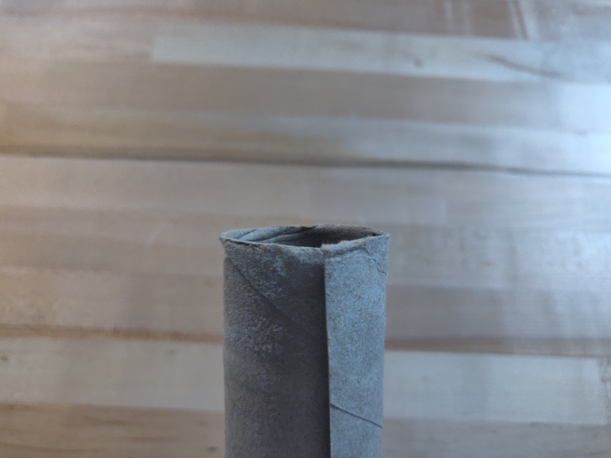

# Lab 4: Speed of Sound - Week 2
---
### All Materials Needed:
- One tube from a paper towel roll, ~28 cm long. 
- A second, same-sized, paper towel tube, (may or may not have paper towels attached)
- Scissors
- Tape
- Measuring tape, meter stick, or ruler

### Optional Materials

- Laptop
- Headphones

### Lab Goals:
- ** Construct an apparatus **
	- Create a variable-length tube
- ** Data Analysis **
	- Measure the speed of sound in your room.
---

# Part I: Building the Apparatus

::: Exercise
In this exercise you will build the resonant cavity that you will use in next week&rsquo;s lab. Basically, we want to construct one tube that fits perfectly inside of another one. That way we can slide the inner tube out of the outer tube to make a longer tube.

1. Start by collecting all of the materials listed at the top of the lab.

::: Figure:Figure

:::

::: Note
If you don&rsquo;t have paper towel rolls, you can tape multiple toilet paper rolls together or use a different type of cardboard tube. You can use one from a roll of aluminum foil or saran wrap. You just need two that are the same diameter, or one that fits perfectly inside the other already. If you already have a tube that fits perfectly inside of another one, you are done with the apparatus. (Rolled up printer paper, card stock or cardboard should also work.)
:::

2. Take your empty cardboard tube, and cut it down its length.

:::Figure:Figure
:::row
:::column

Cut the tube down its length.
:::

:::column

This is what it should look like after being cut.
:::
:::
:::

3. Take the cut tube and fold one part of the seem under the other as shown in the figure below.

:::Figure:Figure

:::

4. Slide the cut tube into your second tube. Leave just about a tape&rsquo;s width sticking out of the outer tube.
5. Then wrap the piece that is sticking out in tape. Don&rsquo;t wrap it multiple times, and don&dsquo;t wrap it so tightly that it reduces the size of the tube too much. You want it to fit snugly inside the other tube, but to slide fairly easily.

::: Figure:Figure
:::row
:::column

Make sure to leave a little piece sticking out.
:::

:::column

Don't wrap the tape too tightly.
:::
:::
:::

6. Now push the other end out and do the same thing. Then slide the inner tube out.
7. Tape over a couple more parts on the tube to make sure it stays cylindrical.

:::Figure:Figure
:::row
:::column

This is what it should look like after Step 6.
:::

:::column

This is the completed inner tube.
:::
:::
:::

8. Now slide the inner tube into the outer tube. You are done!

:::Figure:Figure

Finished tube.
:::

:::

# Part II: The Experiment

## The Experiment

For this lab you will build a cardboard tube whose length you can change. You will then use phyphox to generate a constant-frequency tone, and place your phone&rsquo;s speaker at the end of the tube. You will then adjust the length of the tube until a standing wave forms in the tube and it resonates. When this happens, you will hear a significant increase in the volume of the sound.

:::Figure:Figure

:::

Figure 7 shows is a sketch of sound intensity as a function of tube length for the fundamental in an open-open pipe. This is an **example** plot of an adjustable, around 1 meter, pipe, with a frequency of 171.5 Hz playing.  Notice there is a background volume of the speaker playing, but as the length of the pipe nears the length of 1 m the volume increases dramatically.

The simulation below will allow you to experiment with this.
 
:::Figure:Simulation
embed src="https://kapawlak.github.io/PhDemoJS/Apps/TubeResonance/index.html" width="100%" height="800"
:::

### What will you be doing?

In last weeks lab you derived an equation for the length of the pipe, $L$, as a function of the number of segments, $n$. 

You will play a frequency from Phyphox into your tube and adjust its length until it resonates. Then you will  measure the length. Without changing the frequency you will increase the length of your tube by sliding the inner tube out of the outer tube. When you hit another resonance you will measure the length of that tube.

You will then make a plot of $L$ vs $n$ and determine the speed of sound from that plot.

:::Question
What is the equation you derived last week that has length as a function of number of segments?
:::

:::Question
If you were to create a plot of $L$ vs $n$ and fit a line to it, what would expression for the slope be?
:::

:::Exercise
In this exercise you will determine what frequency is needed to have five resonances over the change in length of your pipe.

1. If you have a thermometer or way of measuring the temperature inside of your room, use that, otherwise assume it is about $20^{\circ}$C inside. Then determine the speed of sound in your room.

The uncertainty in the speed of sound based on temperature is given by the following:

:::Figure:Equation
$$
\delta v_s = 0.6 \delta T
$$
:::

::: Question
a) What temperature is your room and how did you measure/estimate it?

b) What is the uncertainty in the temperature?

c) What is the speed of sound in your room with uncertainty?
:::

2. Now determine the length over which you are able to adjust your pipe. Use last week for help.

:::Question
a) What did you use to measure the length?

b) What is the length over which you can adjust your pipe (the length of the inner pipe)? Include uncertainty.
:::

3. You want to collect five data points so you will need five segments to be inside of your change in length. Use the same calculation you did last week to determine what frequency is needed to get five segments.

:::Question
What frequency should you use? Show your work.
:::

4. Take the frequency  you calculated in Question 5 and add 100 Hz to it. This will be the frequency that you will use for the experiment.

:::Question
Why should we add 100 Hz to the frequency you calculated? Hint: What assumptions did you make when making that calculation? What about your apparatus might make it hard to get all five standing waves?
:::

:::

:::Exercise
In this exercise you will collect the data.
you will play that frequency from your phone and listen for resonances. When you here a resonance you will then measure the length of your pipe. Then adjust the length and repeat.

1. Start by opening the Phyphox app and selecting the "Tone Generator". Put the frequency you determined from Exercise 2. 
2. Locate the speaker on your phone and place your phone so the speaker is right at the edge of a table.
3. Put the tube right up against the phone and then hit play on the tone generator app.

:::Note
You can start with a lower volume, but if you have trouble finding the resonance you may need to increase your volume. 
:::

4. The sound will come out the tube and may or may not be resonating. Spend some time *slowly* sliding the inner tube out. Listen closely for changes in volume.

:::Note
This can be slightly challenging to hear. If you move it too fast or slow it will be increase the difficulty. We have found for a frequency of 3200 Hz that moving it 2-4 cm/s is a good speed.  
:::

5. Once you are confident that you can identify the resonances, start with the inner tube completely inside the outer tube. 
6. Then slide the inner tube out until you hear the first resonance. Spend a moment trying to make sure you are really at the maximum volume by slightly adjusting the length.
7. Stop the sound and now measure the length of your tube.
8. In a table record the length of the tube, and the segment. This first segment will just be $n=1$.
9. Repeat steps 6 - 8 measuring the tube at each resonant and increasing $n$ by one. Do this until you run out of pipe.

::: Question
a) What is the uncertainty in your resonate length measurement?

b) Is it larger, smaller, or the same as just a direct measurement of the tube?

c) What factors are contributing to the uncertainty?
:::

:::

:::Exercise
In this exercise you will analyze you data and determine the speed of sound in your room. 

1. Create a plot of $L$ vs $n$.
2. Fit a line to your plot.
3. Get the slope of the line and use your answer to Question 1 to determine the speed of sound.

:::Question
Even though you have labeled the segments $n=1,2,3,4,5$, there are more than that number of segments in your entire pipe. 

For measuring the speed of sound, why does it not matter that we are not starting the count at the actual number of segments inside of the entire tube?
:::

Typically, most sound producing devices have very small uncertainties in the frequencies they produce. For the purposes of this lab, we will assume the uncertainty in the frequency is small compared to the uncertainty in your length measurements (which will lead to larger uncertainties in your slope).

If we do that, then to propagate the error from the slope to the speed of sound, $v_s$ we will use the following equation. 

:::Figure:Equation
$$
\delta v_s = \frac{v_s}{s} \delta s
$$
:::

:::Question
What is the speed of sound in your room as measured by resonance? Include the uncertainty in your response.
:::

:::

## Conclusion

::: Exercise
Write a short conclusion highlighting the important parts of resonance and the speed of sound, and how they apply to the measurement you will be making. 
:::